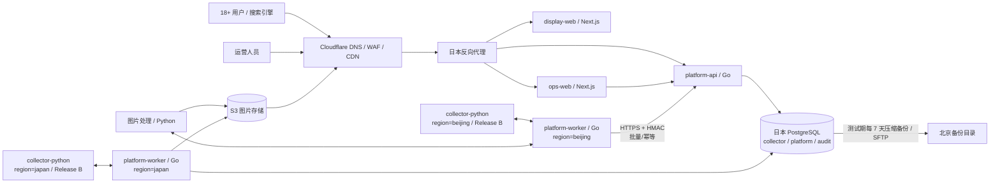

# 作品资料展示平台：系统架构总览

版本：v1.0  
日期：2026-08-30  
详细设计：[PLATFORM_ARCHITECTURE.md](./PLATFORM_ARCHITECTURE.md)  
实施计划：[IMPLEMENTATION_PLAN.md](./IMPLEMENTATION_PLAN.md)
采集计划：[COLLECTION_PLAN.md](./COLLECTION_PLAN.md)

## 1. 目标和约束

### 业务目标

- 建设一个以作品浏览和番号搜索为核心的公开资料站；
- 使用 SEO 详情页获取自然搜索流量；
- 支持人物、作品、图片、来源、审核、账号和反馈；
- 后期接入北京和日本两套自动采集；
- 测试期不接广告联盟，只保留广告位。

### 硬性边界

- 不提供、不存储、不转发视频、音频、磁力、网盘、种子或下载资源；
- 不做头像识别、人脸向量或相关 API；
- Python 只负责采集、解析、图片处理和未来可选 AI；
- 对外和内部业务 API 使用 Go；
- 公开前台与运营后台是两个独立 Next.js 应用；
- 图片二进制不进入 PostgreSQL；
- 自动采集结果必须经过审核才能发布。

### 已知基础设施

| 位置 | 规格 | 主要职责 |
| --- | --- | --- |
| 日本 | 2C4G | 公开网站、运营后台、Go API、Go Worker、主 PostgreSQL；Release B 再启用日本采集器 |
| 北京 | 2C8G | Go Worker、图片处理和数据库备份；Release B 再启用北京采集器 |
| Cloudflare 免费账户 | CDN/WAF/DNS | 公开站与公开派生图缓存、Turnstile |
| 免费 S3 | 10GB、100 万 A 类、1000 万 B 类操作 | 图片母版、派生图和隔离区 |

北京和日本公网往返约 `172ms`。这个延迟适合异步批量 API，不适合日本前台跨区同步查询北京数据库。

## 2. 架构选择

### 2.1 数据库方案比较

| 方案 | 开发和运维 | 前台延迟 | 隔离性 | 当前结论 |
| --- | --- | --- | --- | --- |
| 数据库放北京 | 简单 | 日本每次 SQL 至少增加约 172ms RTT | 一般 | 不采用 |
| 北京、日本双数据库 | 最复杂，需要发布同步、冲突和双备份 | 前台低 | 最强 | 自动采集规模化后再评估 |
| 日本单库、Schema 隔离 | 最简单，发布可同事务 | 最低 | 通过权限和状态隔离 | MVP 采用 |

MVP 使用日本服务器上的一个 PostgreSQL 实例，划分 `collector`、`platform`、`audit` 三个 Schema。Schema 是清晰的迁移边界；当采集规模和资源争用达到阈值时，可把整个 `collector` Schema 迁移为北京独立数据库。

### 2.2 服务形态

采用模块化单体和独立 Worker，不使用微服务、Redis、Kafka、OpenSearch 或 Kubernetes。

理由：

- 当前瓶颈是数据质量、审核和 SEO，不是吞吐量；
- 两台服务器规格有限，额外基础设施会消耗内存和运维时间；
- PostgreSQL 事务、`pg_trgm`、任务表和小时聚合足够支持 MVP；
- Go API 保持模块边界，后续可以按采集、媒体、搜索拆分。

## 3. 物理部署



### 网络原则

- PostgreSQL `5432` 不暴露公网，仅日本本机容器网络访问；
- 北京不直连 PostgreSQL，只调用日本 Go 内部 API；
- `www` 经过 Cloudflare，浏览器 API 使用同域 `/api/*`；
- `ops.example.com` 由日本反向代理进入 `ops-web`，浏览器始终同域使用 Cookie；Next.js Route Handler 再访问同一日本网络内的 Go API；
- `ops` 测试期使用登录保护，正式开放前限制固定 IP 或 VPN；
- `ingest` 仅允许北京、日本服务器，使用防火墙白名单、HTTPS、HMAC、时间戳和 nonce；
- 大文件不经过 Go API 中转；Release A 由北京受控 `media-python` 直接写入 S3/R2 并生成 manifest，开放用户上传后才引入短时预签名；
- 批量文件和数据库备份使用 SSH/SFTP，不使用 FTP 或明文 HTTP。

## 4. 服务清单

| 服务 | 数量 | 技术 | 位置 | 职责 |
| --- | ---: | --- | --- | --- |
| `display-web` | 1 | Next.js + TypeScript | 日本 | 首页、搜索、详情、登录用户界面、SSR/ISR |
| `ops-web` | 1 | Next.js + TypeScript | 日本 | 采集、审核、发布、图片、用户和反馈管理；正式开放前叠加固定 IP、VPN 或 Cloudflare Access |
| `platform-api` | 1 | Go | 日本 | 公开、账号、后台、采集接收 API |
| `platform-worker` | 2 个部署 | Go | 北京、日本各一 | 任务租约、批次、邮件、聚合、归档、发布和区域协调 |
| `collector-python` | 2 个按需任务（Release B） | Python | 北京、日本各一 | Release A 不部署或启动；后续由对应 Go Worker 按任务启动，网页采集、解析和标准化候选；不常驻、不互抢任务 |
| `media-python` | 1 | Python | 北京 | 图片校验、去 EXIF、压缩、派生和备份 |
| PostgreSQL | 1 | PostgreSQL | 日本 | 唯一事实数据库和任务表 |
| Reverse proxy | 1 | Nginx | 日本 | 公开站、后台和 API 的 TLS、路由、请求限制和安全头 |

`platform-worker` 使用同一份 Go 代码，以环境变量区分能力。下列采集能力描述的是 Release B 目标态；Release A 两地均固定 `COLLECTION_ENABLED=false`：

```text
日本：region=japan; ingest,publish,email,metrics,archive；有日本区域任务时启动 Python CLI
北京：region=beijing; ingest,media,batch-upload
```

北京 Worker 不拥有数据库凭证。它通过任务租约 API 获取 `region=beijing` 的任务，按需启动本地 Python CLI，结果写入本地 spool 后批量提交日本。日本 Worker 同样只在领取到 `region=japan` 的采集任务后启动 Python CLI，任务结束即退出。日本临时不可达时采用指数退避，不能丢批次。

Release A 将 `ops-web` 与 API 一起放在日本，避免每个后台请求跨越约 172ms 的公网链路，也与当前日本 Compose 模板一致。北京不承载浏览器后台入口；它只通过独立 HMAC/防火墙边界执行未来批次与媒体任务。运营后台的安全隔离由独立 Host、短会话、近期密码确认以及正式开放前的固定 IP、VPN 或 Cloudflare Access 提供。

## 5. 单数据库三 Schema

### `collector`

只存放采集、标准化和审核前数据：

```text
sources
source_connectors
source_records
raw_snapshot_refs
normalized_records
review_tasks
conflict_reviews
jobs
publication_batches
media_staging
```

### `platform`

只存放正式业务和用户数据：

```text
works
work_aliases
performers
performer_aliases
performer_source_mappings
studios
tags
work_performers
work_tags
field_provenance
content_revisions
publications
search_documents
media_assets
media_objects
media_derivations
entity_media
users
sessions
email_challenges
favorites
follows
view_history
content_metrics_hourly
feedback
```

### `audit`

只存放安全、权利、归档和运维记录：

```text
audit_logs
login_events
account_closure_events
takedown_requests
archived_history_manifests
backup_runs
notification_deliveries
```

### 数据库角色

| 角色 | 权限 |
| --- | --- |
| `collector_writer` | 读写 `collector`，不能修改 `platform` |
| `publisher` | 读取审核结果，在事务中写 `platform` 和审计记录 |
| `platform_app` | 读写公开业务与账号表，不读取原始快照 |
| `public_reader` | 只读 `published` 视图 |
| `audit_writer` | 追加审计，禁止普通更新和删除 |

Python 采集器不持有任何数据库角色。公开 API 读取 `public_published_works`、`public_published_performers` 等视图，不直接查询草稿与历史版本。

## 6. 核心数据流

### 6.1 采集与发布

```text
区域 Go Worker 领取任务
  -> 调用本地 Python 采集器
  -> 本地暂存与批量打包
  -> HTTPS/HMAC 提交日本 Go API
  -> collector.source_records 幂等落库
  -> 归一化、去重、冲突检测
  -> 人工审核
  -> Go 发布服务开启数据库事务
  -> 写 content_revision + platform 正式表 + publication
  -> 提交事务
  -> 刷新搜索文档、页面缓存和 sitemap
```

每个批次必须有 `batch_id`，每条记录必须有 `idempotency_key` 和 `content_hash`。重复提交返回原结果，不能重复创建。已人工核验的数据不能被后采集值静默覆盖。

### 6.2 内容状态

```text
draft -> reviewing -> published
                   -> hidden
                   -> takedown
                   -> archived
```

- 只有 `published` 可由公开 API 和 SEO 页面读取；
- 已发布修改先创建新版本，审核通过后替换；
- `hidden` 可由管理员恢复；
- `takedown` 是高风险权利状态，不允许自动恢复；
- `archived` 用于合并、失效和历史版本。

### 6.3 作品和人物身份

- `work_id`、`performer_id` 使用永久 UUID；
- 番号和艺名不作为主键；
- 作品以规范番号、厂牌、发行日期和来源映射判重；
- 人物以艺名、别名、读音、来源映射和活动信息生成疑似候选；
- 自动流程只创建合并候选，人工决定合并；
- 合并后保留旧 ID 到新 ID 的永久重定向。

## 7. 搜索、渲染和统计

### 搜索

MVP 使用 PostgreSQL B-tree、`pg_trgm` 和 `search_documents`：

```text
番号精确 > 番号前缀 > 艺名/别名 > 标题 > 厂牌 > 模糊匹配
```

达到任一条件再评估独立搜索：作品超过 50 万、搜索 P95 连续两周超过 300ms 且索引优化无效，或 PostgreSQL 搜索明显争用公开事务负载。

### 页面缓存

- 作品、人物、厂牌详情使用 SSR/ISR，发布后定向失效；
- 首页和列表缓存 5-10 分钟；
- 搜索结果动态请求且默认 `noindex`；
- 个性化模块在浏览器登录后加载，不进入公共缓存；
- Cloudflare 缓存公开 HTML、图片和静态资源；
- 带账号状态的响应禁止公共缓存。

### 浏览统计

每个详情页加载后，前端立即向不缓存的统计接口发送一次请求；接口不自动重试。每个被接受的请求直接执行小时聚合 `UPSERT page_views = page_views + 1`。

匿名请求不保存事件明细、会话、IP、设备或路径。统计接口访问日志不记录原始 IP。登录用户可同时写入精确到秒的 `view_history`。

## 8. 账号与安全

### 邮箱验证码

注册、忘记密码和关闭账号共用 `email_challenges`：

```text
purpose = signup | reset_password | close_account
code_hash
expires_at
attempt_count
consumed_at
```

注册先完成邮箱验证再创建正式账号。密码重置后撤销全部旧会话。关闭账号前必须有登录态、明确提示和邮箱验证码；成功后状态设为 `closed`，账号不能登录，原邮箱可以创建新的 UUID 账号。

### 防批量注册

- Cloudflare Turnstile；
- 邮箱、IP 和请求目的多维限流；
- 统一响应避免账号枚举；
- 验证码哈希、10 分钟过期、5 次尝试；
- 发送额度告警和熔断；
- 一次性邮箱先标记风险，测试期不做大范围误封。

### 会话与密码

- Argon2id 密码哈希；
- 服务端会话和 `HttpOnly + Secure + SameSite` Cookie；
- 状态改变请求使用 CSRF 防护；
- 管理后台短会话和高风险操作重新验证；
- 登录失败限流；
- 普通用户不能修改角色；
- 密钥仅从环境或 secret 文件注入，不能进入仓库和日志。
- `APP_ENV=production` 启动前必须同时配置 PostgreSQL、认证 HMAC、SMTP、Turnstile、允许来源和公开图片基地址；缺少任一项时 API 直接退出，避免把账号或图片能力静默降级后上线。

## 9. 图片与容量

R2/S3 使用两个不同 bucket 隔离公开边界；北京本地 inbox 不上传：

```text
北京本地 inbox                 原始输入，处理完成后按运营策略清理
S3_PRIVATE_BUCKET/media-master/ 私有标准化母版，不绑定公开域名
S3_PUBLIC_BUCKET/media-public/   公开派生图，绑定图片域名
```

数据库备份不占用免费 S3 图片额度，发送到北京服务器备份目录。每个逻辑 `asset_id` 记录：

```text
version
s3_key
storage_scope
backup_path
public_url
sha256
width
height
byte_size
image_status
publication_status
```

发布采用两阶段：S3 校验及派生成功、北京备份完成、manifest 写入并由日本数据库确认后，才公开 `public_url`。S3 不可用时页面使用日本本地默认图。

额度护栏：

下表是完整目标策略，不代表均已完成真实验收。当前已有北京单机共享上传锁、双桶当前对象与未完成 multipart 部件核算、超限拒绝及中断证据保护，见[容量手册](./docs/MEDIA_UPLOAD_CAPACITY.md)。`MEDIA_DELIVERY_MODE` 提供最高优先级人工执行；`MEDIA_DELIVERY_DYNAMIC_MODE=enforce` 可让日本 API 按请求读取既有粘性用量状态去图，并让 Next Proxy 每个文档请求读取私有策略，以 CSP/默认图约束旧 ISR HTML，任一读取错误 fail-closed；默认 off 的 Cloudflare 私有 R2 网关代码可在对象缓存/R2 前执行同一策略，见[主动停图](./docs/MEDIA_DELIVERY_MODE.md)与[边缘网关](./docs/MEDIA_EDGE_GATEWAY.md)。不改变数据库权利/对象状态，删除和账号保持可用。账户 A/B 与 Storage Analytics 仍非账单；网关、bucket 私有化、route/binding/purge 和已启用入口需要真实验收，已经下载到浏览器的图片不能撤回。默认 10 GiB 不是供应商 10 GB/GB-month 的账单保证。

| 使用率 | 行为 |
| ---: | --- |
| 70% | 告警、检查孤儿和重复对象 |
| 85% | 暂停非必要重处理和大图导入 |
| 95% | 只允许替换、下架和关键发布 |
| 100% | 停止图片上传/处理，展示默认图；正文服务继续 |

“超出后停止服务”具体落地为停止图片子系统，而不是让文字资料、账号和权利下架一起不可用。

2026-09-11 已新增 Go Worker 的[账户用量查询](./docs/MEDIA_USAGE_OBSERVATION.md)和[持久观察/可选定时器](./docs/MEDIA_USAGE_STATE.md)。一次性命令现同时查询 A/B 操作量和 Storage Analytics：同一时点跨全部已观测 bucket 求和、按 UTC 日取峰值，并用整数定点估算 30 日制 GB-month；只有显式确认全账户 Standard 才比较 10 GB-month。该存储估算不写数据库、不接恢复。迁移 19 增加的私有状态与审计表仍只保存操作量；当前整体 Schema v21，复用日本 Worker/PG，不增加服务，默认 off。显式 observe 后按 5～15 分钟保存整账户 A/B 估计、高水位和粘性复核。默认 off 的[逐操作上传准入](./docs/MEDIA_UPLOAD_ADMISSION.md)、动态页面执行和[Cloudflare 私有 R2 媒体网关](./docs/MEDIA_EDGE_GATEWAY.md)消费持久操作量状态。Cloudflare Analytics 不能代表账单；供应商版本历史、类别、水位、共享应用及网关真实部署仍未验收。迁移 20 的[管理员复核/账期切换](./docs/MEDIA_USAGE_REVIEWS.md)仍是恢复保护的唯一授权路径。

## 10. 资源预算

日本 2C4G 的 MVP 建议上限：

| 组件 | 内存预算 |
| --- | ---: |
| PostgreSQL | 约 1.2GB，总体；`shared_buffers` 约 512MB |
| Next.js | 512-768MB |
| Go API + Worker | 300-500MB |
| 日本 Python 采集任务 | 按需 256-384MB，任务结束释放 |
| 反向代理、Docker 与系统 | 500-700MB |
| 峰值余量 | 至少 600MB |

约束：

- PostgreSQL `max_connections` 30-50，Go 使用连接池；
- 日本不执行图片处理；日本采集 CLI 同时最多 1 个且只在低峰启动，北京图片处理最多 2 个；
- 采集写入并发每区 2-4，批次 100-1000 条；
- 日本备份、采集 CLI 和批量发布不能同时运行；
- Node 设置明确内存上限；
- 日志轮转并设置磁盘 70/80/90% 告警；
- 当内存长期超过 80% 或公开 API 饱和，先降低 Worker 并发，再考虑迁移组件。

## 11. 可靠性与运维

### MVP 目标

```text
公开站月可用性：>= 99.5%
缓存命中 API P95：< 300ms
非缓存搜索 P95：< 500ms
测试期备份 RPO：<= 7 天；正式生产前提升为 <= 24 小时
恢复 RTO：<= 4 小时
审核发布到前台：95% 在 5 分钟内
```

### 备份

- Release A 低流量测试期每 7 天从日本执行 PostgreSQL 压缩备份；
- 使用 SFTP 传到北京；
- 测试期正常保留最近 4 份周备份；最后完整已验证恢复点及未验证/异常文件受保护，超额标记 deferred 并安排补验，不为满足份数直接硬删；
- 正式生产前升级为每日 7 份加每周 4 份，并把 RPO 收紧到 24 小时；
- 备份加密并记录 SHA-256、大小和完成状态；
- 每月恢复到临时数据库并跑关键行数与外键检查；
- 恢复测试失败必须告警，不能只检查文件存在。

### 轻量监控

- `/healthz` 只检查进程，`/readyz` 检查关键依赖；
- Docker Compose 健康检查和自动重启；
- Go/Python JSON 日志、`request_id` 和批次 ID；
- 监控延迟、错误、流量、饱和度、任务积压、数据库连接、磁盘和 S3 额度；
- 数据库不可用、任务进入 `dead`、磁盘超过 80% 和 S3 阈值发送邮件；
- 测试期不部署完整 Prometheus/Grafana 集群。

## 12. 故障行为

| 故障 | 系统行为 |
| --- | --- |
| 北京无法访问日本 | 本地 spool 保留批次，指数退避，公开站不受影响 |
| 日本无法访问北京 | 暂停北京任务；日本采集和公开站继续 |
| 来源站失败 | 任务重试或 `dead`，线上保留最后已发布版本 |
| PostgreSQL 不可用 | API `readyz` 失败，公开缓存仍尽量服务，禁止写入 |
| S3 不可用/额度耗尽 | 停止媒体写入，页面显示日本默认图 |
| 图片处理失败 | 资料可继续审核，图片保持 staging，不公开半成品 |
| 发布失败 | 同一事务回滚，线上继续使用上一版本 |
| 权利下架 | 立即隐藏、清缓存和公开对象，审计任务持续重试 |
| 邮件服务失败 | 注册/重置/关闭暂不可用，已有用户浏览不受影响 |

## 13. 演进触发条件

优先优化顺序：Cloudflare 缓存、SQL/索引、批处理、增加进程，最后才拆服务。

满足以下任意两项时，评估将 `collector` 迁移到北京独立数据库：

- 活跃来源超过 20 个；
- 每日采集变更超过 10 万条；
- 采集写入持续影响公开 API P95；
- `collector` 数据占数据库空间超过 40%；
- 北京需要在日本断网时连续运行超过 24 小时；
- 采集团队需要独立发布和迁移节奏。

拆库时保持导入 API、UUID、幂等键和发布批次合同不变。`collector` 变为北京事实库，只有审核发布包进入日本 `platform` 数据库；这是演进，不是 MVP 前置条件。

## 14. 架构决策记录

| 决策 | 选择 | 原因 |
| --- | --- | --- |
| 主数据库位置 | 日本 | 公开请求不跨 172ms 链路查询数据库 |
| MVP 数据库数量 | 1 个 PostgreSQL | 成本和运维最低，发布可同事务 |
| 数据隔离 | `collector/platform/audit` Schema + 角色 | 为后续拆库保留边界 |
| API | Go | 对外与内部合同统一、资源占用低 |
| 采集与图片 | Python | 解析和图像生态成熟 |
| 前端 | 两个 Next.js 应用 | 公开站与运营后台独立发布和权限 |
| 队列 | PostgreSQL `jobs` + 租约 | 不增加 Redis，支持区域任务和失败恢复 |
| 搜索 | PostgreSQL `pg_trgm` | MVP 数据量和机器规格足够 |
| 图片 | S3 主存储 + 北京备份 + Cloudflare | 统一版本、映射、缓存和下架 |
| 广告 | 仅占位 | 测试期不加载联盟脚本 |
| 备份 | 测试期每 7 天到北京、正常保留 4 份，保护恢复点/未验证文件时暂缓清理；正式期每日 7 份 + 每周 4 份 | 测试期节省空间且不牺牲最后恢复点，正式期限制最大数据损失 |

已有持久观察状态现在可供[定时全量对账准入](./docs/MEDIA_TASK_ADMISSION.md)消费：日本 Worker 在准备前/发送前重核，达到 85%、状态缺失/失效/复核时拒绝新扫描，保留必要删除服务。独立开关默认 off；不增加服务/数据库表。日本 API/Next 动态停图和 Cloudflare 私有 R2 网关代码已完成，网关判断位于对象缓存之前；但在真实 bucket 匿名入口关闭、Worker route/R2 binding/purge 验收前，仍不能声称源站和旧缓存已经受控。其余分级执行与真实目标验收仍未完成。

2026-09-11：[跨区上传控制](./docs/MEDIA_UPLOAD_CONTROL.md)已具备日本 Go 一次性命令、北京 Python 私有接口、共享卷持久日志、epoch/generation CAS 和双向签名回执。上传准入/每页 Listing/每次 PUT 检查同一状态；PUT 期间返回 busy，暂停与 pending 相互独立。复用现有服务、不让北京直连 PG；默认 off，需全部上传器配套升级。v21 已补齐后台授权队列、操作者审计和回执落库；后台 `/media/upload-control` 已实现状态/独立确认/回执、缺失或过期禁止新操作及原键重试；逐操作反向准入/系统暂停不伪造人工请求、不清 pending、不自动恢复。日本 API/Next 动态默认图和 Cloudflare 私有 R2 网关均已完成离线代码，Release A 计划内的公开派生图入口可在对象缓存前执行策略；真实 bucket 私有化、Worker route/R2 binding/Cache API/purge 与传播仍待验收。协议、取舍、升级及回滚边界见各媒体手册。
