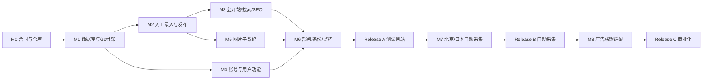

# 作品资料展示平台：MVP 实施计划

版本：v1.0  
日期：2026-08-30  
产品基线：[PRODUCT_PLAN.md](./PRODUCT_PLAN.md)  
架构基线：[ARCHITECTURE.md](./ARCHITECTURE.md)  
详细合同：[PLATFORM_ARCHITECTURE.md](./PLATFORM_ARCHITECTURE.md)

## 1. 交付目标

2026-09-12 Ubuntu 验收更新：此前“缺少 PostgreSQL/Mailpit”和“本机 SQL 未执行”的记录已由本轮隔离 Docker 真实验收推进。当前结果与后续目标环境门槛统一见[Ubuntu 验收证据](./docs/evidence/release-a-ubuntu-acceptance-2026-09-12.md)及[发布就绪审计](./docs/RELEASE_A_READINESS.md)；本计划较早日期段落保留历史语境，M5 与公网仍待真实 R2/Cloudflare/目标主机验收。

先交付一个可以真实录入、审核、发布和浏览的测试网站，再开发自动采集。第一版完成时必须具备：

- 匿名用户可浏览、按番号搜索、查看最新与热门；
- 管理员可人工录入人物、作品和厂牌，通过作品 CSV 批量导入作品，并导入媒体处理器生成的图片 manifest；
- 草稿、审核、发布、版本、回滚、隐藏和权利下架闭环；
- 注册、登录、邮箱验证码、收藏、关注、历史、反馈和关闭账号；
- owner/admin 邀请账号、邮箱验证码接受邀请、角色限制、邀请撤销和审计记录；
- 图片标准化、S3 发布、默认图和资产 manifest；
- 日本单库三 Schema、测试期每 7 天北京备份、监控和告警；
- SEO 详情页、canonical、sitemap 和缓存；
- 广告位占位，但不加载广告联盟。

自动采集属于第二次交付，不能阻塞测试网站上线。

## 2. 开发顺序



按单人全栈开发估算，Release A 约 10-12 周；前后端可并行时约 6-8 周。估算不包含真实资料整理、权利核验和外部政策审查。

## 3. M0：合同与仓库基线（2-3 天）

### 工作项

- 建立推荐目录结构；
- 初始化 Go workspace、两个 Next.js 应用和 Python worker 包；
- 添加日本/北京 Docker Compose 开发模板；
- 定义统一错误结构、时间、UUID、cursor 和幂等约定；
- 创建 OpenAPI 和 ingest JSON Schema 的最小骨架；
- 建立 `.env.example`，确认 secret 不进入 Git；
- 添加本地合成数据，不放真实人物或图片到测试仓库。

### 验收

- `display-web`、`ops-web`、Go API、Go Worker、Python Worker 和 PostgreSQL 可在本地启动；
- `/healthz` 返回构建版本，`/readyz` 能区分数据库不可用；
- 前端通过生成/校验的 OpenAPI 类型调用本地 API；
- CI 能执行空项目的 lint、test 和 build。

## 4. M1：数据库与 Go 基础（1 周）

### 工作项

- 创建 `collector`、`platform`、`audit` Schema；
- 创建数据库角色与最小权限；
- 建立作品、人物、别名、厂牌、关联、来源、revision、publication、审计和 outbox 表；
- 建立用户、session、email challenge、收藏、关注、历史、反馈和小时聚合表；
- 建立 `user_invitations` 表、pending 邮箱唯一约束、48 小时有效期和验证码尝试计数；
- 建立 `collector.jobs`、批次和幂等表；
- 建立 `pg_trgm`、规范番号和常用状态索引；
- 用 pgx 参数化 SQL 和类型化 repository 建立明确事务封装；保留按模块引入 sqlc 的演进空间；
- 准备 fresh install、向前升级和失败回滚测试。

### 关键数据库测试

- Python/collector 角色不能写 `platform`；
- `public_reader` 读取不到 draft、hidden、takedown；
- 同一 ingest 幂等键不会创建两条来源记录；
- 同一作品允许出现需要人工判断的番号复用；
- 活动账号邮箱唯一，关闭账号邮箱可创建新 UUID；
- revision 与 publication 的外键和状态约束有效；
- 小时浏览并发 UPSERT 不丢计数。

### 验收

- 空数据库可一次迁移到最新版本；
- 迁移失败不会留下半创建状态；
- 权限测试和核心约束测试全部通过；
- 生成的 ERD/表清单与详细架构一致。

## 5. M2：人工录入、审核与发布（1.5-2 周）

### Go API

- 管理员登录、角色和短会话；
- 人物/作品/厂牌草稿 CRUD；
- CSV 预检、错误行下载和幂等导入；
- 错误 CSV 以 UTF-8 BOM 和完整引用格式导出；任何以控制空白及 `= + - @` 开头的单元格先加文本前缀，避免管理员用表格软件打开时触发公式注入；
- 别名、人物关联和来源记录；
- duplicate/conflict 候选；
- 审核领取、批准、驳回；
- revision、发布、隐藏、回滚、合并；
- 权利下架和追加审计；
- outbox Worker 和失败重试。

### 运营后台

- 登录页；
- 仪表盘：待审核、冲突、失败任务、S3/备份状态；
- 人物、作品、厂牌列表和编辑页；
- 来源字段和核验时间编辑；
- 版本差异、审核、发布和回滚；
- 合并候选及旧 ID 重定向；
- 权利下架流程；
- CSV 导入进度和错误展示。

### 验收场景

1. 编辑录入作品并关联人物；
2. 编辑不能直接发布；
3. 管理员审核发布；
4. 公开视图立即出现新版本；
5. 发布副作用失败进入 outbox 重试；
6. 管理员回滚到旧版本；
7. 权利下架后公开视图、搜索和媒体关联消失；
8. 全流程能按 request ID 找到审计记录。

## 6. M3：公开网站、搜索和 SEO（1.5-2 周）

### 页面

- 首页与最新发行流；
- 最近收录、近期热门、30 日最多和编辑推荐；
- 搜索页；
- 作品详情；
- 人物详情及作品列表；
- 厂牌页；
- 桌面与移动页头显示游客“登录/注册”入口，登录后切换账号菜单；
- 详情页收藏、关注和纠错操作接入登录门槛；
- 页脚资料说明、18+ 和权利邮箱；
- 顶部、列表、两侧和底部广告占位。

### 搜索

- 番号精确、去分隔符和前缀查询；
- 标题、艺名、别名和厂牌匹配；
- `pg_trgm` 模糊兜底；
- cursor 分页和排序白名单；
- 零结果聚合，不保存匿名查询事件；
- 语句超时和慢查询日志。

### SEO 与缓存

- `/works/{code}-{short-id}` 等稳定 URL；
- canonical、Title、Description、Open Graph；
- 作品、人物、厂牌拆分 sitemap；
- 动态搜索/筛选/账号页 `noindex`；
- 首页、robots 和 sitemap 在运行时生成；公开目录 API 数据和成功目录响应按 5 分钟策略缓存，详情页使用同一 `public-catalog` 数据标签；
- 发布/隐藏/下架按标签失效；
- Cloudflare 规则：公共 HTML/静态资源缓存，账号与统计接口 bypass。

### 性能验收

- 移动端无明显布局重排，CLS 目标 `< 0.1`；
- 缓存命中页面 LCP 目标 `< 2.5s`；
- 公开 API P95 缓存命中 `< 300ms`；
- 搜索 P95 `< 500ms`；
- 图片、广告占位和长标题不改变核心布局尺寸；
- 桌面和移动视口通过 Playwright 截图检查。

## 7. M4：注册、账号与用户功能（1-1.5 周）

### 邮箱验证码

- 注册验证码请求与 Turnstile；
- 验证成功后才创建账号；
- 忘记密码验证码与新密码；
- 关闭账号验证码与明确前端提示；
- 6 位、10 分钟、60 秒重发、5 次尝试；
- 邮箱/IP 限流、统一响应、邮件额度熔断；
- 验证码和 session 只存哈希。

### 用户功能

- 登录/登出和服务端 session；
- 登录、注册、忘记密码统一账号窗口与表单错误状态；
- 账号菜单包含收藏、关注、历史、账号设置和退出；
- 用户与权限页支持创建、列表和撤销邀请；公开 `/invite` 页接受邀请后创建对应角色并登录；
- 收藏作品、关注人物；
- 登录历史精确到秒；
- 清除历史后 `is_deleted = true` 且前端不可见；
- 隐藏不感兴趣；
- 反馈必须登录；
- 反馈只接收纯文本和 URL 线索，不自动访问 URL；
- 关闭账号后撤销所有 session，旧账号不能登录。

### 安全验收

- 不能通过响应判断邮箱是否注册；
- 过期、重放、错误用途验证码都失败；
- 修改密码和关闭账号后旧 session 失效；
- 普通用户不能调用管理员 API 或修改角色；
- CSRF、XSS、开放重定向、SQL 注入和 URL SSRF 负向用例通过；
- 日志不包含验证码、密码、Cookie 和完整邮箱。

## 8. M5：图片子系统（1-1.5 周）

2026-09-11 容量与降级复核：共享 OS 锁、完整双桶当前对象与未完成 multipart 部件计量、256 列表请求预算、未知写入证据和共享卷已有代码；`MEDIA_DELIVERY_MODE` 执行端覆盖北京新上传、日本公开/用户目录去图、Next 新渲染/旧 HTML CSP 默认图及 edge no-store。见[容量恢复](./docs/MEDIA_UPLOAD_CAPACITY.md)和[主动停图](./docs/MEDIA_DELIVERY_MODE.md)。Go 的[一次性查询](./docs/MEDIA_USAGE_OBSERVATION.md)现同时读取账户操作量和 Storage Analytics：保留 `bucketName + datetime`，同一时点跨全部已观测 bucket 求和、按 UTC 日取峰值，并用整数定点估算 30 日制 GB-month；Standard 免费额度比较须显式操作者确认。该结果不写数据库、不接执行，固定不是账单或供应商水位。[持久观察/可选定时器](./docs/MEDIA_USAGE_STATE.md)仍只保存操作量，Schema v21、默认 off；已接定时对账和[逐操作上传准入](./docs/MEDIA_UPLOAD_ADMISSION.md)，后者在拒绝/失效时持久化系统暂停，默认 off。[人工复核/账期切换](./docs/MEDIA_USAGE_REVIEWS.md)已开发，仍待真实 SQL 验证。[对象存储任务清单](./docs/MEDIA_STORAGE_TASK_POLICY.md)确认 Release A 唯一非必要自动数据面任务是全量对账，已有双阶段准入；**当前仍需真实存储账单/版本历史/未返回 bucket 与共享应用完整性，以及真实网关/源站验收**，不是只缺凭据，不承诺账户零费用。

此前每日检查轮次（2026-09-11）：每日注册图片公开状态与固定默认图检查、独立审计和后台告警已接入，该轮引入 Schema v18（当前整体 v21）。真实 SQL 状态矩阵、并发调度与目标存储仍待验证，M5 不标完成。见[每日检查证据](./docs/evidence/release-a-media-inspection-2026-09-11.md)。

2026-09-10 实施复核：M5 **未完成整体验收**。安全处理、三档派生、默认图、manifest、容量保护、v17 公开隔离、删除任务幂等/原 URL 保留和草稿下架均已有代码。本轮补齐主图读取/比较旧资产后事务替换、后台独立确认、共享旧图保留、非共享公开图立即删除排队和私有母版 30 天后删除排队；权利下架可提前期限。新增三组 PostgreSQL 替换合同（含并发竞争）与此前登记/退出/隔离合同本机仍未执行。剩余工作包括真实 SQL、缓存与双 bucket/北京副本的完整生命周期验证，不只是填写外部配置。详见[主图替换证据](./docs/evidence/release-a-media-primary-2026-09-10.md)。

### 工作项

- S3 隔离区、母版和公开派生图前缀与 IAM；
- 当前对账补充状态：完整响应校验、字节有界样本、拿锁后新快照调度与 Go→Python HTTP 合同已补；真实调度 SQL 待执行。每日注册公开状态及默认图检查已独立接入；还需实际 SQL/权限及目标部署验证，完整 M5 另有本节列出的额度开发待办。见[对账证据](./docs/evidence/release-a-reconciliation-2026-09-10.md)。
- Release A 北京受控 CLI 上传并生成不可手填的 manifest；开放用户上传时再增加短时预签名；
- MIME、10MB、像素、解码、SVG/动画和 EXIF 校验；
- 标准母版与 320/640/960 WebP；
- 原始大图成功处理后删除；
- 作品/人物独立默认图；
- `media_assets/objects/derivations/revisions/entity_media`；
- 北京备份路径与 manifest；
- 两阶段发布；
- Cloudflare 版本 URL；
- 普通替换保留 30 天和权利下架删除；
- S3 70/85/95/100% 护栏；
- 已开发账户 A/B 估计查询、5% 建议预留、统计失败/倒退/过期的持久复核和可选定时器；一次性报告已增加全账户已观测 bucket 的存储日峰值/GB-month 整数估算，但未持久化、未接自动恢复。已实现管理员复核/账期切换请求与 Worker 校验处理，仍需真实 SQL 验证、可信供应商账单/存储类别/版本历史/共享应用完整性和真实边缘入口验收。Release A 对象存储任务已登记为机器清单；未来新增非必要任务必须先接准入，不将 Analytics 计数当账户计费；
- 每日孤儿、缺失、权限和哈希对账。

### 验收场景

- 正常图生成三种派生尺寸并正确映射；
- 伪装 MIME、超大像素、SVG 和损坏文件被拒绝；
- 登记事务中途失败时没有半发布的数据库记录；注意已上传公开桶的对象仍可能通过已知 URL 访问，CLI 仅处理事先已确认允许公开的图片，不作保密待审存储；
- S3 不可用时页面自动使用默认图；
- S3 100% 时上传停止但文字站和下架仍可用；
- 图片替换不会被 Cloudflare 旧缓存覆盖；
- 权利下架后公开 URL 不可用，审计仍可查询。

## 9. M6：部署、备份和监控（1 周）

### 日本

- Reverse proxy、公开站与运营后台两个 Next.js、Go API、Go Worker 和 PostgreSQL Compose；Release A 固定 `COLLECTION_ENABLED=false`，不部署或启动 Python 日本采集器；
- Cloudflare origin TLS、DNS 和缓存规则；
- 只开放 80/443/受控 SSH；
- PostgreSQL 仅容器网络；
- 默认图和关键静态资源本地可用；
- 运营后台测试期登录保护，正式开放前叠加固定 IP、VPN 或 Cloudflare Access；
- 服务资源限制、连接池和日志轮转。

### 北京

- Go Worker、`media-python` 和 spool，不承载浏览器运营后台；Python 采集器留到 Release B；
- `ingest` 防火墙白名单与 HMAC；
- 备份目录权限、空间告警和 SFTP 账号；

### 备份

- Release A 测试期每 7 天执行 `pg_dump -Fc`、SHA-256、SFTP 和原子完成；
- 测试期正常保留最近 4 份，最后完整已验证恢复点与未验证/异常文件受保护，超额 deferred 时补验；正式生产前升级为每日 7 份加每周 4 份；
- `audit.backup_runs` 状态；
- 每月临时恢复与自动一致性检查；
- 记录实际 RPO/RTO。

### 监控

- `/healthz`、`/readyz` 和 Worker 心跳；
- API 错误/延迟、数据库连接、任务积压、备份年龄、磁盘、S3 额度和邮件失败；
- 告警邮件分严重度；
- 运维手册包含重启、回滚、恢复、下架、S3 满额和邮件故障。

### Release A 上线门槛

- 全量 CI 通过；
- fresh migration 和备份恢复通过；
- 管理员录入到公开发布端到端通过；
- 注册、重置、关闭账号真实邮件流程通过；
- 权利下架端到端通过；
- 桌面/移动视觉与性能门槛通过；
- 无高严重度安全问题；
- S3、服务器、Cloudflare 和邮件政策已核对；
- 至少准备 30 个人物、100 部作品的可追溯测试目录；可由双确认、仅空测试库允许的 Release A fixture 工具显式加载，不进入生产迁移。

## 10. M7：自动采集 Release B（2-3 周，Release A 后）

### 区域 Go Worker

- 区域任务租约、心跳、完成、失败；
- 北京本地 spool、断网重试和幂等上传；
- 同一镜像按区域能力配置；
- dead 任务后台重试和取消。

### Python 连接器

详细任务、CLI、JSONL 合同、脚本接入和 Release B 分阶段验收见 [COLLECTION_PLAN.md](./COLLECTION_PLAN.md)。

- 来源插件接口；
- 普通网页解析和结构变化检测；
- 百度/Google/网页搜索只作为人工候选入口，遵守访问规则；
- 不绕过验证码、封锁或服务条款；
- 规范番号、标题、人物别名、厂牌、发行日期；
- 身体参数、社交账号和图片只生成待审候选；
- 来源 URL 可空但来源类型、核验时间、置信度必填。

### 自动化边界

- 采集器不能直接发布；
- 图片、身体参数、社交账号和人物关联必须人工确认；
- 多来源冲突不能按“最后写入”覆盖；
- 北京与日本只领取自己的区域任务；
- 同一来源外部 ID 和 content hash 不重复入库；
- 日本访问得到、北京访问不到的来源可以分配日本，但不得规避来源限制。

### Release B 验收

- 北京断网 1 小时后恢复，批次不丢不重；
- 同一批次提交 3 次只落一份；
- 两区同时采集不会抢同一任务；
- 来源结构变化只隔离对应连接器；
- 冲突进入人工队列，已发布字段不被覆盖；
- 自动采集造成的资源占用不使公开 API 超过 SLO。

## 11. M8：广告联盟 Release C（Release B 稳定后）

只有测试网站和自动采集稳定、自然流量形成可观察基线，并确认联盟接受目标内容类别后才进入本阶段。

### 工作项

- 建立 provider adapter，不把联盟脚本写死在页面组件；
- 顶部、信息流、桌面左右侧栏和正文底部使用统一 `AdSlot`；
- 不使用底部悬浮广告、倒计时、首屏插屏、强制跳转或伪装按钮；
- 配置 CSP allowlist、异步加载、超时和一键停用；
- 广告失败回退为空位或自有素材，不阻塞 SSR 和正文 API；
- 按页面类型、设备和位置记录填充、可见展示、点击和收入；
- 同时观察 Page RPM、LCP、CLS、跳出率和自然搜索流量。

### 进入门槛

- Release B 连续运行至少 30 天，无未解决高严重度故障；
- 广告联盟书面政策允许当前内容和目标地区；
- 页面流量达到所选联盟的最低申请门槛；
- 加载测试中广告导致的 LCP 增量低于 300ms；
- 任一联盟脚本可通过功能开关立即停用。

### 验收

- 联盟超时或脚本错误不影响作品资料和搜索；
- 广告与资料内容视觉区分并显示“广告”；
- 移动端不出现左右溢出、遮挡和布局跳动；
- 后台可按 provider/placement 停用；
- 收益提升以不破坏 SEO、页面性能和用户访问为前提。

## 12. CI 质量门槛

每次合并必须至少执行：

```text
Go: gofmt check, go vet, go test ./..., race test（关键包）
Python: ruff, type check, pytest
Next.js: lint, typecheck, unit test, production build
Database: fresh migration, upgrade migration, permission/constraint tests
Contracts: OpenAPI lint, generated client drift, ingest JSON Schema fixtures
Security: secret scan, dependency audit, container non-root check
E2E: Playwright 关键匿名、账号和后台流程
```

API 合同变更必须同时更新 OpenAPI、生成类型、正反例 fixture 和兼容说明。数据库迁移默认采用 expand/contract：先增加兼容结构，发布代码后再删除旧结构。

## 13. 测试矩阵

| 层 | 必测内容 |
| --- | --- |
| 单元 | 番号归一、slug、角色、状态机、验证码、推荐配额 |
| 数据库集成 | 事务、唯一/部分索引、并发 UPSERT、租约、权限 |
| API | 校验、401/403/404/409/413/429/503、幂等和 cursor |
| Worker | 崩溃重领、超时、重复执行、dead、spool 恢复 |
| 媒体 | 文件炸弹、MIME 伪装、EXIF、SSRF、两阶段发布 |
| 前端 | SSR 内容、noindex、canonical、长文本、默认图、响应式 |
| 安全 | 注册轰炸、账号枚举、CSRF、XSS、SSRF、权限提升 |
| 恢复 | 数据库恢复、上一版本回滚、S3 故障、北京断网 |

## 14. 发布与回滚

### 发布前

1. 冻结迁移和 OpenAPI 版本；
2. 完成数据库备份并校验；
3. 构建带 Git commit 的不可变镜像；
4. 在本地/预发布环境运行迁移和冒烟；
5. 先部署兼容数据库迁移，再部署 API/Worker，最后部署前端；
6. 检查 health、ready、关键接口和页面。

### 回滚

- 前端和 Go 镜像可切回上一不可变版本；
- 数据库优先 roll-forward 修复，不对有数据迁移盲目向下回滚；
- 发布内容使用 revision 回滚，不恢复整库；
- 只有数据库灾难才使用北京备份；
- 回滚后验证登录、搜索、详情、发布、下架和统计。

## 15. 真实联调需要准备的数据与账号

本地开发和第一轮合成链路不要求用户先准备真实资料；仓库自带 30 个人物、100 部作品和关联关系的确定性 fixture。进入真实环境联调时按下表逐步准备：

| 项目 | 最小数量/信息 |
| --- | --- |
| 首批真实人物 | 建议 2～3 条，包含公开艺名和成年确认状态；可后补 |
| 首批真实作品 | 建议 5～10 条，包含番号、标题和实际发行日期；可后补 |
| 关联 | 对应作品人物、厂牌和别名映射；可先用 fixture 验证 |
| 图片 | 可选；有图需来源类型、权利状态，无图验证默认图 |
| 来源 | 来源名称、类型、可选 URL、核验时间和操作人 |
| 邮件 | SMTP/API 测试账号、发件域名和额度 |
| S3/R2 | endpoint、region、私有母版桶、公开范围派生桶（匿名访问关闭、仅供 Worker binding）、最小权限凭证和 Cloudflare 单文件 purge token |
| Cloudflare | 测试域名、Turnstile site/secret key、缓存规则权限 |
| 服务器 | SSH、磁盘容量、操作系统、Docker 版本和防火墙计划 |
| 权利联系 | 公开邮箱、负责人和响应时限 |

真实数据不需要一次准备完整。先用仓库 30 人/100 作品 fixture 跑通合成链路，再用少量真实资料验证人工录入、异人审核、发布、搜索和下架，随后逐步扩充。

## 16. 完成定义

2026-09-11 M5 增量：[手动跨区上传执行端](./docs/MEDIA_UPLOAD_CONTROL.md)、v21 后台授权队列/操作者关联/可信回执、上传控制页面、逐操作反向准入与系统暂停、API/Next 动态默认图及[Cloudflare 私有 R2 网关](./docs/MEDIA_EDGE_GATEWAY.md)均已完成离线代码，所有执行器默认 off，不增加额外常驻服务。用量复核不能自动恢复；真实 PostgreSQL/Analytics/Linux 卷/SDK、bucket 私有化、Worker route/R2 binding/Cache API/purge、5 秒传播与存储账单口径仍未验收，因此 M5/Release A 和公网仍 no-go。最新网关验证见[边缘证据](./docs/evidence/release-a-media-edge-gateway-2026-09-11.md)，逐操作准入见[准入证据](./docs/evidence/release-a-media-upload-admission-2026-09-11.md)。

一个功能只有同时满足以下条件才算完成：

- 产品文案和权限符合确认决策；
- API 合同、错误语义和数据约束已落地；
- 正常、失败、权限和幂等测试通过；
- 日志、指标和告警足以定位失败；
- 不泄露密码、验证码、Cookie、密钥和匿名行为明细；
- 有部署、迁移、回滚或下架方法；
- 对应文档与实际代码一致。
