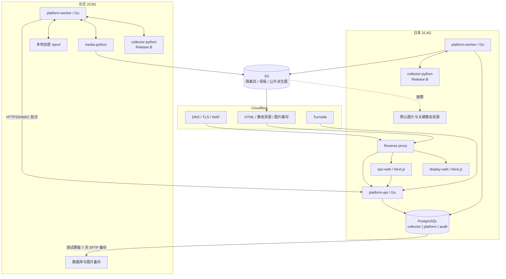

# 作品资料展示平台：详细技术架构

版本：v1.0  
日期：2026-08-30  
上位文档：[PRODUCT_PLAN.md](./PRODUCT_PLAN.md)  
部署总览：[ARCHITECTURE.md](./ARCHITECTURE.md)  
开发拆分：[IMPLEMENTATION_PLAN.md](./IMPLEMENTATION_PLAN.md)  
采集计划：[COLLECTION_PLAN.md](./COLLECTION_PLAN.md)

## 1. 决策范围

本文定义 MVP 的模块边界、数据库 Schema、核心不变量、API 合同、跨区采集、发布、图片、账号、安全、SEO 和运维要求。

当前范围：

- 日本 2C4G 和北京 2C8G 两台服务器；
- 一个部署在日本的 PostgreSQL；
- 一个公开站和一个独立运营后台；
- Go 负责 API 和业务 Worker；
- Python 负责采集、解析和图片处理；
- Cloudflare 免费账户和 10GB 免费 S3；
- 人工审核优先，自动采集后置；
- 广告位占位，暂不接广告联盟。

当前不解决：多活数据库、自动扩容、Kubernetes、人脸识别、广告竞价、匿名用户画像和数据仓库。

## 2. 逻辑架构



关键原则：

1. 公开请求只依赖日本服务、PostgreSQL 和可降级的 S3/Cloudflare。
2. 北京故障不能拖垮公开网站。
3. 北京服务不持有 PostgreSQL 凭证。
4. Python 不直接写正式数据，也不能发布内容。
5. 所有跨区写入都可重试、幂等、可审计。
6. 所有公开内容都来自不可变发布版本。

图中的北京、日本 `collector-python` 是 Release B 目标节点。Release A 的 Compose 不部署采集器，Go Worker 在 `COLLECTION_ENABLED=true` 时直接拒绝启动，避免测试站误启自动采集。

## 3. 代码与模块边界

### 3.1 推荐仓库结构

```text
apps/
  display-web/                 Next.js 公开站
  ops-web/                     Next.js 运营后台
services/
  platform-api/                Go API 入口
  platform-worker/             Go Worker，同一镜像按区域启用能力
workers/
  collector-python/            Python 来源采集和解析（按需 CLI）
  media-python/                Python 图片处理
packages/
  api-contracts/               OpenAPI、生成的 TS 客户端
  ingest-contracts/            JSON Schema / Python 与 Go 合同样例
db/
  migrations/                  带 goose Up/Down 标记的版本化 SQL
  tests/                       PostgreSQL 权限与数据合同
  seeds/                       受控枚举和本地测试数据
infra/
  compose/japan/
  compose/beijing/
  proxy/
  scripts/
docs/
```

### 3.2 Go API 模块

`platform-api` 是模块化单体：

| 模块 | 所有权 |
| --- | --- |
| `catalog` | 作品、人物、厂牌、标签、关联 |
| `search` | 归一化、搜索文档和排序 |
| `publication` | 草稿、版本、审核、发布、隐藏、回滚 |
| `provenance` | 字段来源、置信度、核验时间 |
| `media` | 资产清单、状态和下架；预签名上传在开放用户上传时再启用 |
| `identity` | 注册、会话、邮箱验证码、角色、关闭账号 |
| `library` | 收藏、关注、历史和不感兴趣 |
| `feedback` | 纠错、来源建议和审核队列 |
| `metrics` | 匿名小时聚合和登录用户历史 |
| `ingest` | HMAC、批次、幂等、区域任务租约 |
| `audit` | 审计追加和高风险操作记录 |

每个模块分 transport、domain、repository 三层。HTTP handler 不直接拼 SQL；跨模块写入通过 domain service 和明确事务完成。

### 3.3 具体技术基线

```text
HTTP: chi + net/http
数据库: pgx + 模块化 repository（参数化 SQL）
迁移: 仓库内 psql 迁移器（读取 goose Up/Down 标记）
日志: slog JSON
密码: Argon2id
会话: 服务端 session + 安全 Cookie
合同: OpenAPI 3.1 + JSON Schema
前端: Next.js App Router + TypeScript
部署: Docker Compose
```

Release A 采用 `pgx` 和按模块拆分的类型化 repository，所有动态值必须通过参数绑定，HTTP handler 不直接拼 SQL。当前规模下不引入 `sqlc`，减少生成代码和迁移成本；当查询数量、多人协作或编译期列映射收益明显增加时，可在不改变 repository 接口的前提下逐模块引入。

迁移 SQL 保留通用的 `-- +goose Up/Down` 分段格式，但生产部署不依赖 goose CLI。`infra/database/migrate.sh` 使用 `psql` 执行 Up 段，持有项目级 advisory lock，要求版本从 1 连续、每个版本独立事务，并验证每个迁移显式写入预期 Schema 版本；Down 段只用于测试空库的逆序回滚。

## 4. PostgreSQL 设计

### 4.1 Schema 所有权

```text
collector   采集事实、候选、任务和审核前数据
platform    已发布目录、媒体清单、账号和用户功能
audit       安全、权利、归档和运维证据
```

禁止使用 `public` Schema 存业务表。迁移启动时撤销应用账号对 `public` 的 CREATE 权限。

### 4.2 `collector` 表

| 表 | 关键字段与约束 |
| --- | --- |
| `sources` | `source_id`, `name`, `source_type`, `base_url`, `priority`, `status` |
| `source_connectors` | `source_id`, `region`, `connector_type`, `cursor`, `schedule`, `enabled` |
| `source_records` | `id`, `source_id`, `external_id`, `entity_type`, `content_hash`, `payload`, `received_at`; 唯一 `(source_id, entity_type, external_id, content_hash)` |
| `raw_snapshot_refs` | 压缩快照文件路径、SHA-256、大小和过期时间；大 HTML 不进入数据库 |
| `normalized_records` | 规范字段、解析版本、验证错误和候选状态 |
| `review_tasks` | 类型、目标、优先级、状态、领取人和截止时间 |
| `conflict_reviews` | 字段、旧值、新值、来源优先级和人工结论 |
| `jobs` | 区域任务、租约、重试、幂等键和错误 |
| `publication_batches` | 批次 ID、输入数量、接受/拒绝数量、状态和摘要 |
| `media_staging` | 候选图片 URL、来源、下载和审核状态，不存二进制 |

`source_records.payload` 可使用 JSONB 保留输入合同，但正式查询不能依赖 JSONB 内的临时字段。标准化成功后写入有类型的候选列或审核 payload。

### 4.3 `platform` 目录表

| 表 | 关键字段与约束 |
| --- | --- |
| `works` | UUID、规范番号、标题、实际发行日期、厂牌、`edition_of`, 状态 |
| `work_aliases` | 作品 ID、别名类型、原值和规范值 |
| `performers` | UUID、公开艺名、成年核验状态、活动状态、发布状态 |
| `performer_aliases` | 人物 ID、语言、别名原值和规范值 |
| `performer_source_mappings` | 来源与外部人物 ID 的唯一映射 |
| `studios` | UUID、名称、规范名和状态 |
| `tags` | 受控 slug、标签名和状态 |
| `work_performers` | 唯一 `(work_id, performer_id, role)` |
| `work_tags` | 唯一 `(work_id, tag_id)` |
| `field_provenance` | 实体、字段、来源类型/URL、核验时间、操作人、置信度、权利状态 |
| `content_revisions` | 实体、版本、不可变 payload、作者、审核人和原因 |
| `publications` | 实体、站点、当前版本、状态、发布时间和 canonical slug |
| `redirects` | 旧实体/slug 到当前地址，避免合并或改名产生死链 |
| `search_documents` | 实体、番号、标题、人名、别名、厂牌的规范搜索文档 |
| `site_content_rules` | 首页混排比例等展示规则；测试默认作品 : 人物 = 4 : 1 |
| `outbox_events` | 与发布事务一同写入的缓存、ISR、sitemap 任务 |

重要约束：

- 番号不是主键，也不做无条件全局唯一；
- 对规范番号建立 B-tree，判重再结合厂牌、发行日期和来源映射；
- `edition_of` 不能指向自身，应用层阻止版本环；
- 同一实体和站点只能有一个当前 `published` publication；
- 发布表只能引用已审核 revision；
- `field_provenance.checked_at` 使用带时区时间戳，来源 URL 可空，来源类型不可空。

### 4.4 媒体表

| 表 | 关键字段 |
| --- | --- |
| `media_assets` | 逻辑 `asset_id`、资产类型、当前版本、来源和权利状态 |
| `media_objects` | `asset_id`, version, rendition, private/public storage scope、S3 key、backup path、public URL、SHA-256、尺寸、字节和状态 |
| `media_derivations` | 母版到 320/640/960 派生图的父子关系、格式和处理参数 |
| `media_revisions` | 不可变版本、父版本、编辑人、时间、工具和理由 |
| `entity_media` | 实体、资产、用途、顺序、主图标识、发布状态 |

约束：

- `s3_key` 全局唯一，已发布对象不得原地覆盖；
- 同一实体只能有一张有效主图；
- 作品主图只能使用 `cover / primary / position 0`，作品精选图只能使用 `gallery / non-primary / position 1-3`，三个位置不可重复；人物只接受 `avatar / primary / position 0`；
- 精选图登记要求作品已有有效主图，最多三张；公开读取再次过滤用途、主图标识和位置，历史异常关联不会被提升为封面；
- 同一 SHA-256 可复用对象，但来源和权利记录不能丢失；
- `entity_media` 只能公开关联审核通过且权利状态允许的资产；
- 图片替换使用新不可变资产/URL，非共享旧公开图立即排队删除，旧母版私有保留 30 天后排队清理；主图替换 API/后台已接入，实际数据库及存储清理仍待验收，普通登记接口不隐式替换；
- 权利下架按要求删除公开对象、母版和北京备份，只保留不含图片的审计证据。

### 4.5 账号和用户表

| 表 | 关键字段与约束 |
| --- | --- |
| `users` | UUID、规范邮箱、验证时间、密码哈希、角色、状态、创建/关闭时间 |
| `sessions` | 随机 token 的哈希、用户、过期、撤销、最近使用时间 |
| `email_challenges` | 可空用户 ID、邮箱、用途、验证码哈希、过期、尝试、消费时间 |
| `user_invitations` | 目标邮箱、受邀角色、验证码哈希、发送/过期/消费时间、状态、尝试次数和邀请人 |
| `security_rate_limits` | 短期窗口、维度哈希、计数和过期；定时清理 |
| `favorites` | 唯一 `(user_id, work_id)`，支持软删除 |
| `follows` | 唯一 `(user_id, performer_id)`，支持软删除 |
| `view_history` | 用户、实体、精确浏览时间、`is_deleted`, `deleted_at`, `archived_at` |
| `hidden_preferences` | 用户、作品、创建时间和状态 |
| `feedback` | 用户、实体、类型、纯文本、线索 URL、审核状态 |
| `content_metrics_hourly` | 内容、小时桶、浏览次数；唯一 `(content_type, content_id, hour_bucket)` |

活动邮箱使用部分唯一索引：

```sql
CREATE UNIQUE INDEX users_open_email_uq
  ON platform.users (normalized_email)
  WHERE account_status <> 'closed'
```

因此关闭账号可以保留原记录，同时允许同一邮箱注册为新的 UUID。认证查询只匹配 `active` 用户；`locked`、`suspended` 等状态不能被同邮箱绕过注册。

### 4.6 `audit` 表

| 表 | 用途 |
| --- | --- |
| `audit_logs` | 管理员/系统动作、对象、前后版本、原因、请求 ID、精确时间 |
| `login_events` | 用户 ID、结果、时间和有限风险标识，不存密码/验证码 |
| `account_closure_events` | 关闭提示版本、验证挑战、关闭时间和操作者 |
| `takedown_requests` | 请求方、对象、证据引用、状态、处理时间和结果 |
| `archived_history_manifests` | 归档路径、用户范围、时间范围、条数、SHA-256 和创建时间 |
| `backup_runs` | 备份文件、大小、校验、复制和恢复验证结果 |
| `notification_deliveries` | 邮件类型、目标用户、供应商 ID、状态和错误分类 |

审计记录采用追加模式。更正审计信息通过补充事件完成，不覆盖原事件。

### 4.7 时间和删除约定

- 数据库统一保存 UTC `timestamptz`；
- 前端按用户时区显示，运营后台默认 Asia/Shanghai；
- API 时间使用 RFC 3339，精确到秒；
- 用户“清除历史”设置 `is_deleted = true`，公开查询必须过滤；
- 账号“关闭”设置 `account_status = closed`，不是物理删除；
- 归档不改变已向用户说明的保留事实；
- 权利图片删除与账号软删除是不同流程，不得混用。

## 5. 数据库事务和发布

### 5.1 发布事务

审核任务从 `pending` 领取为 `claimed` 后绑定领取人；只有该领取人可以批准或驳回。换人必须是显式、可审计的重新分配操作，不能由另一个管理员在决定接口中隐式接管。

一次发布必须在同一事务中完成：

1. 锁定审核任务和目标实体；
2. 验证 revision、来源、图片和状态；
3. 写正式实体和关联；
4. 更新 publication 当前版本；
5. 追加审计记录；
6. 写 `outbox_events`；
7. 提交事务。

ISR、缓存、站点地图和通知不在事务内同步调用。Go Worker 使用 `FOR UPDATE SKIP LOCKED` 领取 outbox，按事件 ID 幂等执行。失败只重试副作用，不回滚已经成功的正式发布；在副作用完成前公开 API 仍可读取新版本，旧缓存按短 TTL 过渡。

每次领取递增既有 `attempt_count` 并返回数据库租约截止时间，完成/失败必须同时匹配事件、Worker、原领取次数和未过期租约，不能只依赖可复用的 Worker 名称。Dispatcher 按整批剩余租约给每次副作用设置超时，并为结果落库预留 1 秒；过期或关闭后不再提交旧结果、不启动同批后续副作用。媒体完成事务先锁定并重新校验 outbox 行，再修改媒体对象，防止旧事务提前释放容量。崩溃后重领的事件如果已达到 10 次，转为 `dead/attempts_exhausted`，不继续递增到数据库 20 次硬约束之外。该机制仍为 at-least-once，接收端必须幂等；本机调度测试已通过，真实 SQL 并发合同已接 CI、尚待执行。

副作用不能仅凭 HTTP 2xx 判定完成。缓存失效必须收到 HTTP 200 JSON 的 `revalidated=true` 和相同事件 ID；媒体删除必须收到 `status=deleted`、相同事件 ID、存储范围及对象 key。回执限制为 4096 字节的完整 UTF-8 JSON，空响应、HTML、异步受理和错配回执均重试。Worker 未配置处理器时拒绝执行。图片回执升级先部署北京接收端，再部署日本 Worker；不涉及数据库迁移。

### 5.2 版本与回滚

```text
draft revision
  -> reviewing
  -> approved
  -> published publication_version=N
```

修改已发布资料必须创建 `N+1` revision。回滚不是恢复备份，而是把当前 publication 指向一个已审核旧版本并产生新的审计事件。

### 5.3 下架

权利下架是高优先级事务：

```text
publication -> takedown
entity_media -> hidden
outbox -> purge HTML/API/Cloudflare/sitemap/search
media job -> 删除公开对象和按规则删除私有对象
audit -> 保留不含二进制的证据
```

对已确认永久下架的详情地址返回 `410 Gone`；临时隐藏返回通用 `404`，避免泄露草稿或内部状态。

## 6. 跨区采集与任务

### 6.1 任务状态

```text
pending -> running -> completed
                   -> retry -> running
                   -> dead
                   -> cancelled
```

`cancelled` 只能由管理员或系统暂停动作写入，重新执行必须创建新任务或明确记录恢复原因。`collector.jobs` 至少包含：

```text
job_id
job_type
region              beijing | japan
source_id
payload
idempotency_key
status
attempt_count
next_run_at
lease_owner
lease_expires_at
last_error_code
created_at
updated_at
```

北京和日本 Worker 只领取自己的 `region`。领取使用短租约；Worker 崩溃后租约过期可重领。连续失败达到上限进入 `dead`，后台需要显示重试、取消和错误摘要。

### 6.2 区域任务 API

```text
POST /internal/v1/jobs/lease
POST /internal/v1/jobs/{job_id}/heartbeat
POST /internal/v1/jobs/{job_id}/complete
POST /internal/v1/jobs/{job_id}/fail
```

所有请求携带：

```text
X-Worker-ID
X-Region
X-Timestamp
X-Nonce
X-Signature
X-Request-ID
```

签名覆盖方法、路径、时间戳、nonce 和请求体 SHA-256。服务器拒绝过期时间戳、重复 nonce、区域不匹配和超过大小的载荷。

### 6.3 批量导入合同

```http
POST /internal/v1/ingest/batches
Content-Encoding: gzip
Idempotency-Key: batch_uuid
```

```json
{
  "batch_id": "uuid",
  "source_id": "source_a",
  "region": "beijing",
  "records": [
    {
      "external_id": "remote_123",
      "entity_type": "work",
      "operation": "upsert",
      "source_updated_at": "2026-07-31T10:00:00Z",
      "idempotency_key": "source_a:work:remote_123:v8",
      "content_hash": "sha256:...",
      "payload": {
        "code": "MK-1042",
        "title": "...",
        "release_date": "2026-07-18"
      },
      "provenance": {
        "source_type": "public_web",
        "source_url": null,
        "checked_at": "2026-07-31T10:00:00Z",
        "confidence": 0.75
      }
    }
  ]
}
```

限制：每批默认 100-1000 条、压缩后最大 5MB。相同 Idempotency-Key 和相同 body 返回原响应；相同键但不同 body 返回 `409 IDEMPOTENCY_MISMATCH`。

### 6.4 本地 spool

北京 Worker 在调用日本前先写本地 spool：

- 文件名使用批次 UUID，不使用来源标题；
- 保存 payload、SHA-256、创建时间和重试次数；
- 写临时文件后原子重命名为 ready；
- 服务启动扫描未完成批次；
- 日本确认批次持久化后才删除；
- spool 目录不可由 Web 服务器访问，设置磁盘额度和 70/80/90% 告警。

## 7. 去重、冲突和来源

### 7.1 作品

候选匹配顺序：

1. 来源映射完全一致；
2. 规范番号 + 厂牌一致；
3. 规范番号 + 发行日期 + 人物集合高度一致；
4. 标题、日期、厂牌和人物生成疑似候选；
5. 无法确认则新建候选或进入人工队列。

编号相同但厂牌或人物明显冲突时不能自动合并。重发、合集或不同剪辑版使用独立 UUID，并通过 `edition_of` 或系列关系连接。

### 7.2 人物

人物别名、日文读音、罗马字、中文译名和来源映射参与候选匹配。艺名相同不等于同一人物；图片也不能作为自动合并依据。合并必须由管理员确认，并为旧 URL 创建永久重定向。

### 7.3 冲突优先级

```text
管理员人工确认
  > 本人/事务所/厂牌官方来源
  > 已核验资料站
  > 普通网页和搜索结果
  > 用户提交线索
```

优先级只帮助生成建议值。后采集值不能覆盖已人工确认字段。番号、发行日期、人物关联、图片、身体参数和社交账号冲突必须进入 `conflict_reviews`。

## 8. 媒体子系统

### 8.1 对象分区

Cloudflare R2 使用两个不同 bucket，并在各自 bucket 内使用版本化 key：

```text
media-master/{asset_id}/v{version}/master.webp
media-public/{site_id}/works/{work_id}/{asset_id}/v{version}/cover-640.webp
media-public/{site_id}/performers/{performer_id}/{asset_id}/v{version}/avatar-320.webp
```

母版私有；公开前缀只允许读。对象键版本化，禁止覆盖。Release A 原图只进入北京本地受控 inbox，不上传到 S3；`media-python` 使用受限凭据直接写母版和派生图，运营浏览器没有 S3 凭据。开放用户上传后才增加私有 `media-inbox` 和短时预签名。

### 8.2 处理流程

```text
管理员放入北京本地受控 inbox
  -> 校验 MIME / 大小 / 像素 / 解码 / SHA-256
  -> 移除 EXIF，拒绝 SVG 和异常动画
  -> 生成去元数据的私有 WebP 母版
  -> 生成 320 / 640 / 960 WebP；AVIF 后置
  -> 北京备份与 manifest
  -> 生成完整 JSON manifest
  -> 运营后台人工核对来源、权利、关联和副本
  -> 日本 API 事务登记并发布
  -> 公开 URL
```

Release A 不下载候选 URL，来源 URL 只作为可选溯源字段。Release B 若启用下载，Python 组件必须重新解析每次重定向并拒绝：内网、环回、链路本地、云元数据 IP、非 HTTP(S)、超限响应和 DNS rebinding。用户反馈 URL 不进入此流程。

### 8.3 两阶段公开

第一阶段在数据库外准备已确认允许公开的图片：派生、北京备份、S3 HEAD 和哈希校验全部完成后生成 manifest，母版仍为私有。第二阶段由管理员导入并核对 manifest，API 在一个数据库事务中写入资产、对象、派生关系、关联、审计与 `cache_purge` outbox；任何一步失败均不返回登记成功。缓存刷新异步执行，因此文字 revision 不变的新增图片也会更新公开页。已上传但未登记的对象由对账报告为孤儿，不进入目录；但公开桶中的派生图可能已可通过已知 URL 访问，不能把数据库审核当作对象存储的访问控制。Release A 不把保密待审图片交给该 CLI。

登记在父资料行锁内检查状态，`takedown`/`merged` 拒绝新增；草稿、审核中、已批准、已发布、普通隐藏均可准备图片。Schema v17 的 `public_entity_media` 复用作品/人物主站公开视图，要求父资料与主站 publication 都公开，人物还需通过现有成年状态限制。仅有 published 的图片关联并不代表父资料可公开。v17 不改列或角色授权；真实 PostgreSQL 隔离合同尚待执行。该视图隔离也不撤销已知对象 URL，权利下架仍需独立删除与缓存清理。

展示槽位另由处理器、HTTP 边界、运营后台和数据库仓储共同校验：作品主图为位置 0，精选图为互不重复的位置 1、2、3；精选图必须在有效主图之后登记，第四张或重复位置返回冲突。人物只允许位置 0 的主头像。公开 API 仅从这些有效组合中选择一张主图和最多三张精选图，并要求主图存在；只有精选图或历史异常组合时返回空图片，由前端使用实体专用默认图。本轮不增加迁移，整体 Schema 仍为 v21；父资料行锁可串行化 API 写入，但真实 PostgreSQL 并发与脏数据读取合同仍须在专用测试库执行。见[展示槽位验证](./docs/evidence/release-a-media-display-slots-2026-09-11.md)。

主图替换已接入：`GET /admin/v1/media/primary` 读取父状态和当前关联（不含私有路径）；`POST /admin/v1/media/primary/replace` 接收 `expected_asset_id` 与原始处理器 manifest，要求 admin/owner 和近期密码确认。父资料锁串行化同一资料写入，锁旧资产后重读关联，旧图变化返回 409；新资产/对象/关联、旧关联隐藏、缓存 outbox、替换审计和删除排队同事务。共享检查以其他 published 关联为准（即便其父资料暂时未公开也保守保留）；无其他关联才隐藏旧资产/对象，旧公开派生图立即到期、私有母版 30 天后到期，权利下架可提前。

后台导入清单后读取当前主图；读取失败不可提交，替换需额外确认，不修改生成清单。409 或不确定提交保留文件、取消确认，必须刷新重核；返回资产/状态不匹配不显示成功。新旧资产不可相同，普通 manifest 接口仍只新增。替换本身不增加迁移；当前整体 Schema 为 v21；本地事务/HTTP/界面测试与三组待执行真实 PostgreSQL 替换合同分别记录，不把模拟成功当作物理删除完成。

逐对象删除使用 `media-delete:{media_object_id}` 幂等键，与具体权利工单解耦。退出先锁已有 outbox，再锁媒体对象，与 Worker 完成的锁顺序一致；原公开 URL 清空前进入任务，重复退出时按资产、scope/key/backup_path 从既有任务恢复，不使用来源网页或猜测域名。冲突只可提前 pending/retry 的 `available_at`，不得覆盖 payload、推迟期限、重置失败次数或抢占 running 租约；dead 仍需独立人工复核。公共对象立即到期，私有对象可设置保留期限，权利下架传入当前时间提前到期。数据库字节数仍计入所有未物理删除对象，Worker 只有真实确认后才标 deleted。旧版按工单 ID 生成的事件保留为历史，新键可能产生一次有界重复删除，远端保持幂等，不清除旧证据。退出逻辑本身不增加迁移；当前整体 Schema 为 v21；五组真实 SQL 合同待执行。

未发布资料也可执行权利下架：不存在主站 publication 不再被当作冲突，不创建伪 publication。若公开对象的当前地址和既有删除任务都缺失原地址，则中止并回滚当前下架事务，不创建无效删除任务或返回假成功；需要管理员核对不可变 manifest/对象后修复该异常数据。权利工单 completed 只表示目录撤下与任务已持久登记，不是 S3/缓存/北京副本删除回执。

数据库不得半登记；对象存储与数据库不共享事务。完整目标要求对账任务每日检查：

- 数据库存在但 S3 缺失；
- S3 存在但数据库无引用；
- public 前缀对象并非 published；
- 北京备份与 SHA-256 不一致；
- 默认图文件是否可读。

当前已接入预期清单/孤儿、S3 HEAD 字节与 sha256 元数据、北京文件实际字节/hash。清单仍包括所有非 deleted 对象，保留的私有母版不能被跳过。每日注册对象公开状态及固定默认图实际 HTTP/MIME/内容哈希检查已独立接入日本 Go Worker，迁移 18 保存结果和故障证据。草稿准备、共享资产、私有保留母版及有效删除排队不误报；未登记物理对象由既有孤儿对账覆盖。只读检查，不自动修复或删图；真实 bucket 权限与完整生命周期仍待验收，M5 不据此完成。

对账报告要求 HTTP 200、application/json、UTF-8、完整且 ≤64 KiB 的 JSON；所有计数和六类样本必须显式存在且身份/范围匹配，不能用缺省 0 代表未执行的检查。每类最多 50 条且 8 KiB JSON 样本，异常总数保持完整。无效报告记 failed/invalid_report，服务不可达记 failed/reconcile_unavailable。调度使用 Read Committed，在事务级 advisory lock 获得后读取最近运行；库存是单语句快照，避免 Repeatable Read 的锁前旧快照漏掉另一 Worker 的刚提交运行。真实并发 SQL 合同尚待执行，见[对账证据](./docs/evidence/release-a-reconciliation-2026-09-10.md)。

检查固定 24 小时一次、5 分钟轮询到期状态；调度拿锁后读取新快照，库存使用独立只读一致性事务，网络请求前释放连接。每类库存最多 10000 条、每次最多 45 秒、默认图每张 5 秒/64 KiB、不跟随重定向。只请求受控展示站 origin 下两条固定路径，不访问资料/来源 URL。审计保留每类最多 50 个 UUID 样本，不保存响应正文。部署须启用 MEDIA_INSPECT_ENABLED；公网模式 origin 与 SITE_URL 相同，内网检查不代表 Cloudflare 通过。详情见[每日检查运行手册](./docs/MEDIA_INSPECTION.md)。

### 8.4 默认图和额度

2026-09-11 补充：现有日本 Go Worker 二进制提供 `media-usage` 只读子命令，绕过常驻服务/数据库初始化，仅在 `--live` 时访问账户级 R2 Analytics。命令 v2 同时读取操作量和 Storage Analytics；存储查询保留 `bucketName + datetime`、同一时点跨全部已观测 bucket 求和、按 UTC 日取峰值，并以整数定点估算 30 日制 GB-month。只有显式 `--standard-only-confirmed` 才比较 Standard 10 GB-month，报告仍不是账单、水位或执行状态。另有默认 off 的持久观察器：迁移 19 保存账户/账期/策略摘要、**操作量**高水位、运行证据和粘性复核，5～15 分钟一次；存储估算未持久化。没有新增第六套服务或数据库，北京不直连 PG/Analytics。当前 Schema v21 已实现[管理员复核/账期切换](./docs/MEDIA_USAGE_REVIEWS.md)，API 不拥有状态 UPDATE 权限。[逐操作上传准入](./docs/MEDIA_UPLOAD_ADMISSION.md)、动态展示与 Cloudflare 私有 R2 网关均默认 off 并消费持久操作量状态。真实 SQL、真实网关和供应商账单/类别/共享应用完整性仍待验收。见[查询边界](./docs/MEDIA_USAGE_OBSERVATION.md)、[持久观察](./docs/MEDIA_USAGE_STATE.md)和[主动降级](./docs/MEDIA_DELIVERY_MODE.md)。

作品和人物默认图随 `display-web` 发布，保存在日本服务器并可由 Cloudflare 缓存。图片地址不可用或资产被下架时使用默认图。人工 `MEDIA_DELIVERY_MODE=default_only` 仍是最高优先级；可选 `MEDIA_DELIVERY_DYNAMIC_MODE=enforce` 让日本 API 对公开/用户目录 DTO 按请求去图，并让 Next Proxy 对旧 HTML 请求实施 CSP，内部策略或数据库失败时 fail-closed。底层资料与运营证据保留，首次启用需重启 API/公开站；启用后的状态变化无需重启，但仍须 Next/Cloudflare HTML 失效来清除或恢复缓存正文。详见[主动降级](./docs/MEDIA_DELIVERY_MODE.md)。它不是账单硬上限，也不是图片源站全入口停图。

当前上传容量准入由北京 Python 单一写入端负责：共享 OS 锁覆盖生成、双桶当前对象 Listing、预计字节校验、备份/PUT/HEAD 和 CLI manifest 持久化。超限拒绝整批；未知写入保留持久 pending 和匹配备份，精确 run-id 人工复核后才恢复，删除/权利下架不被阻断。两地采集仍独立，但 Release A 不允许两地各自绕过北京准入直写桶；新增上传端必须共享同机状态卷，否则需要另行实现分布式准入。

默认上限 10 GiB 保护两个专用桶的当前对象与未完成 multipart 已上传部件，不含供应商历史版本、其他桶或账户 GB-month。一次性命令已有全账户已观测 bucket 的日峰值/GB-month Analytics 估算，A/B 操作量另有持久高水位与保守动态展示/上传执行；二者都不是供应商硬额度。公开读取由私有 R2 网关代码覆盖，但 bucket 私有化、路由/binding/cache/purge 尚未真实验收。Release A 对象数据面按[任务策略](./docs/MEDIA_STORAGE_TASK_POLICY.md)分为受控上传、定时全量对账、必要权利删除和公开读取；唯一非必要自动任务是全量对账，已有双阶段准入。后续仍需真实计费口径、类别/水位/共享应用完整性和预留预算验收；70/85/95% 提示不等于零费用保证。文字、账号、审核及权利下架须继续可用。共享卷与恢复见[容量手册](./docs/MEDIA_UPLOAD_CAPACITY.md)。

## 9. 公开和后台 API

### 9.1 通用约定

```json
{
  "error": {
    "code": "WORK_NOT_FOUND",
    "message": "资料不存在或尚未公开",
    "request_id": "req_abc123"
  }
}
```

- 时间均为 RFC 3339；
- 列表使用 cursor，限制默认 20、最大 50；
- 客户端只能使用白名单排序值；
- 响应不泄露内部异常、原始快照、密钥和审核意见；
- 所有状态改变接口要求 CSRF 或 HMAC，并记录请求 ID；
- 对可重试创建操作支持 `Idempotency-Key`。

### 9.2 公开 API

```text
GET  /api/v1/home
GET  /api/v1/search?q=&type=&sort=&cursor=
GET  /api/v1/works/{canonical_slug}
GET  /api/v1/works/{id}/related
GET  /api/v1/performers/{canonical_slug}
GET  /api/v1/performers/{id}/works
GET  /api/v1/studios/{canonical_slug}
POST /api/v1/metrics/page-view
```

`page-view` 请求只接受 `content_type` 和 UUID，确认内容已发布后直接小时聚合，不自动重试、不写匿名事件明细。若请求带有效登录会话，另写一条用户历史。

### 9.3 账号 API

```text
POST /api/v1/auth/signup/code
POST /api/v1/auth/signup/verify
POST /api/v1/auth/login
POST /api/v1/auth/logout
POST /api/v1/auth/password/code
POST /api/v1/auth/password/reset
POST /api/v1/auth/invitations/accept
POST /api/v1/account/close/code
POST /api/v1/account/close
GET  /api/v1/me
GET  /api/v1/me/history
DELETE /api/v1/me/history
POST /api/v1/me/favorites/{work_id}
DELETE /api/v1/me/favorites/{work_id}
POST /api/v1/me/follows/{performer_id}
DELETE /api/v1/me/follows/{performer_id}
```

验证码发送接口无论邮箱是否存在都返回相同公开响应。注册验证成功后在单一事务中创建账号、标记挑战已消费和创建初始会话。邀请接受接口在同一事务中锁定 pending 邀请、校验哈希验证码、创建目标角色账号、消费邀请并创建会话；新会话按签发时角色设期限：普通用户最长 30 天，owner/admin/editor 最长 8 小时。

密码登录不能仅凭已查询的 UUID 创建 session。API 完成密码验证后将当时的 UUID、邮箱、密码摘要和角色作为内部快照传给 repository；数据库在单条 SQL 中 `SELECT ... FOR UPDATE` 锁账号并重验快照、active 与邮箱已验证状态，再写 session。并发改密、关闭、锁定或角色/邮箱变化导致快照不一致时，返回通用无效凭据，不签发 Cookie/token。重置验证码在预检查及最终事务绑定挑战中的用户 UUID，不能只凭邮箱匹配新账号；改密、消费挑战和撤销旧会话须原子提交。

会话撤销写入 `greatest(request_time, created_at)`，避免请求开始早于并发 session 创建时违反时间约束；操作审计仍保留原始精确时间。上述 SQL 一致性已实现并有受限 PostgreSQL 测试合同，本机尚未执行真实库验证。角色真正变化时，同一事务更新角色、以 `role_change` 撤销该账号所有未撤销 session、保存新旧角色及撤销数量审计；不覆盖原撤销证据。重新登录按 user 30 天、editor/admin 8 小时签发，近期密码确认不能绕过旧 session 失效。相同角色提交返回 409，不撤销新会话、不重复审计；owner、自改角色及关闭账号的边界不变。角色修改与签发共用账号行锁，旧快照等待后必须重验；不声称撤回已鉴权的在途请求。真实 SQL 两组角色合同尚待执行。

密码资源护栏已实现全进程 1 个计算、2 个等待、排队最多 500ms；覆盖所有认证 KDF、模拟账号摘要与 owner 引导。队满/超时返回 503 AUTH_BUSY 与 Retry-After: 1，取消后仍等同步计算返回才释放名额、不写凭据。新摘要保持 Argon2id 64 MiB/t3/p1，既有参数兼容不变；这不是 RSS 硬限制，日本 API 384 MiB/0.40 CPU 下仍需实际验证。详见 [Release A 安全审计](docs/RELEASE_A_SECURITY_REVIEW.md)。

邀请接受先用短事务检查验证码、有效期、错误次数及同 IP 日额度，正确预检不消费邀请、不计额度，不跨密码计算持有数据库锁；计算后用新时间在最终事务重验并原子创建账号/session、消费邀请、计额与审计。注册/重置的最终挑战校验也使用计算后的时间。私有指标以 `self_deepsearch_password_work_` 导出 active/waiting、上限、拒绝/取消/完成聚合，不含账号、邮箱或 IP 标签。新增 SQL 合同沿用当前 v21 受限一次性库，本机未执行；多实例时每个进程独立限额，Release A 仍按单 API 实例规划。

退出采用明确确认合同：Go API 在 2 秒上下文内尝试撤销，成功或原本无会话才返回 204 并清 session/近期密码 Cookie；依赖不可用、超时或取消返回 `503 LOGOUT_UNAVAILABLE`，不清 Cookie，不记录原始 token/错误。两站 `/auth/logout` 校验 Origin 与实际 Host/入口协议一致，忽略 `X-Forwarded-Host`；后台 `no-referrer` 下原生表单可能发送 `Origin: null`，仅在浏览器禁止脚本自设的 `Sec-Fetch-Site: same-origin` 与 `Sec-Fetch-Mode: navigate` 同时成立时接受这种同源导航，其他缺失/null/跨站 Origin 仍拒绝。3 秒内只接受上游 204 且禁止跟随重定向。无法确认时跳转动态、noindex、no-store 的 `/logout?error=unconfirmed`，保留凭据用于原操作重试，明确提示关闭页面不代表退出成功；GET 不执行退出。普通用户误入后台后的自动退出也遵守确认合同。Nginx 和 Cloudflare 必须将 `/logout` 与 `/auth/` 一起排除缓存。网络中断时远端可能已经撤销，重试同一个 token 应幂等成功，不能仅凭清浏览器 Cookie 判断服务端已失效。

### 9.4 反馈 API

```text
POST /api/v1/feedback
GET  /api/v1/me/feedback
```

要求有效登录。仅接受纯文本、实体 ID 和可选 HTTP(S) URL；最大文本长度、URL 数量和每日提交次数必须有限制。后端不请求该 URL。

### 9.5 运营后台 API

```text
GET  /admin/v1/review-tasks
POST /admin/v1/review-tasks/{id}/claim
POST /admin/v1/review-tasks/{id}/approve
POST /admin/v1/review-tasks/{id}/reject
GET  /admin/v1/conflicts
POST /admin/v1/conflicts/{id}/resolve
POST /admin/v1/works
POST /admin/v1/performers
POST /admin/v1/entities/{id}/revisions
POST /admin/v1/entities/{id}/publish
POST /admin/v1/entities/{id}/hide
POST /admin/v1/entities/{id}/rollback
POST /admin/v1/entities/{id}/merge
POST /admin/v1/media/manifests
POST /admin/v1/takedowns
GET  /admin/v1/users
POST /admin/v1/users/{id}/role
GET  /admin/v1/invitations
POST /admin/v1/invitations
POST /admin/v1/invitations/{id}/revoke
GET  /admin/v1/system/health
```

`editor` 只能创建和提交 revision；`admin` 可领取并审核、发布、隐藏和管理普通用户；只有 `owner` 可创建管理员、修改角色、系统配置和执行最高风险操作。审核任务只能由 `admin`/`owner` 领取，领取后绑定领取人，只有该领取人可以批准或驳回。邀请同样遵循角色边界：owner 可邀请 admin/editor/user，admin 只能邀请 user，editor 不得邀请。

### 9.6 状态码

| 状态 | 含义 |
| ---: | --- |
| 200/201/202 | 查询成功、创建成功、批次已接受 |
| 400 | JSON 或参数格式错误 |
| 401 | 未登录或签名无效 |
| 403 | 角色不足或状态禁止 |
| 404 | 公开对象不存在或不可见 |
| 409 | 状态冲突、重复合并、幂等键内容不一致 |
| 410 | 已永久下架的公开地址 |
| 413 | 请求或批次过大 |
| 422 | 合同格式正确但业务校验失败 |
| 429 | 频率或邮件额度限制 |
| 503 | 数据库、邮件或 S3 等依赖暂不可用 |

## 10. 认证、防滥用与隐私

### 10.1 验证码

验证码使用密码学安全随机数，保存 Argon2id 或带服务端 pepper 的 HMAC 哈希，不存明文。发送邮件正文、日志和供应商 metadata 都不能包含密码或 session token。

默认规则：6 位、10 分钟、60 秒重发、5 次尝试；同邮箱每小时 3 次，同 IP 每小时 5 次注册、每日 10 个成功账号。风险升高时要求 Turnstile；首期可以全量启用以简化实现。

### 10.2 账号关闭提示

前端必须明确说明：

> 关闭账号后将无法登录，收藏、关注和浏览记录将不再对你展示。部分操作记录、审计记录和隐私说明约定的信息会继续保存。

关闭后撤销所有 session，异步发送通知邮件。原邮箱再次注册生成全新 UUID，不能继承旧收藏、关注或历史。

密码重置挑战即使仍在有效期内，也只能用于其签发时绑定的活动且已验证用户；旧 UUID 关闭后，相同邮箱的新 UUID 不能继承旧重置挑战。用户操作时间和追加式审计继续保留，不为执行生命周期测试或重注册而删除旧审计。

### 10.3 匿名和日志

匿名 page-view 只写小时聚合。反向代理对该路径关闭 IP 访问日志或使用不可逆截断/短期轮转；Go 只在内存中使用短期风险键。安全接口可以保存短期 `ip_hash`，到期清理；长期审计只保留用户 ID、事件、结果、风险原因和精确时间。

### 10.4 用户历史

用户清除历史后，前台查询必须过滤 `is_deleted = true`。为了节省数据库空间，只有已删除或已关闭账号的历史才进入长期压缩归档；仍需向用户展示的活动历史继续留在 PostgreSQL。

归档采用 gzip JSONL 或 Parquet，保存精确时间、用户 UUID、实体 UUID、删除状态和 schema version。manifest 记录 SHA-256、条数和时间范围。归档不等于匿名化或物理删除。

## 11. 搜索与 SEO

### 11.1 归一化

搜索写入时预计算：Unicode NFKC、大小写、空白、连字符和全角半角归一；原始显示值保持不变。番号同时保存 `canonical_code` 和不含分隔符的 `compact_code`。

两字符以内查询优先精确/前缀索引，避免昂贵模糊扫描。`pg_trgm` 只用于白名单列，所有查询设置 statement timeout。

### 11.2 URL 与收录

```text
/works/{canonical-code}-{short-id}
/performers/{name-slug}-{short-id}
/studios/{studio-slug}-{short-id}
```

详情页输出 canonical、唯一 Title/Description、Open Graph、结构化字段和内部链接。canonical、robots 与 sitemap 的 origin 只来自公开站运行时 `SITE_URL`；生产误配置 fail-closed，不采用构建期公开变量或回环默认值。搜索、任意参数组合、账号、历史、反馈和后台页 `noindex`。只有管理员创建的固定专题页进入 sitemap。

### 11.3 缓存

| 内容 | 策略 |
| --- | --- |
| 作品/人物/厂牌详情 | ISR；发布/下架时按标签失效 |
| 首页/榜单 | 5-10 分钟 |
| 搜索 | 不做公共 HTML 缓存；API 可短 TTL 缓存安全查询 |
| 个性化 | `private, no-store` |
| 图片/静态资源 | 版本 URL，Cloudflare 长缓存 |
| 统计接口 | `no-store`，Cloudflare bypass |

Cookie 存在不应让所有公开 HTML 自动绕过缓存；页面公共主体保持无用户状态，个性化组件再请求 `/api/v1/me/*`。

缓存验收区分“处理器收到匹配回执”和“公开内容实际变化”。本地 `test:cache:release-a` 已用真实 Go 处理器、单实例 Next production build 与合成目录 API 验证首页/详情/sitemap 的运行态场景，包含错误/过期签名不回源、发布立即更新、仅媒体变化、隐藏和重复事件；测试使用独立 standalone 副本，避免污染共享 Next 数据缓存。该合同进入统一预检与 CI web，但不替代 PostgreSQL outbox、Nginx、Cloudflare 或多实例目标部署验收。运行命令与证据边界见 `docs/RELEASE_A_RUNBOOK.md`。

运营后台不从浏览器跨域直连 API。`ops.example.com` 与日本 `ops-web`、Go API 位于同一部署网络；浏览器只请求后台 Host 的同源 `/api/v1/*` 和 `/admin/v1/*`，Next.js Route Handler 再转发到内部 API，Cookie 只作用于 `ops.example.com`。北京服务器只运行独立 Worker/媒体处理入口，不代理浏览器后台流量，也不持有用户 session。

Cloudflare 客户端地址必须沿 `Cloudflare → 日本 Nginx → display-web/ops-web → Go API` 传递。Nginx 在源站入口覆盖 `CF-Connecting-IP`，前端同源代理只继续转发该值；Go 仅在 `TRUST_PROXY_HEADERS=true` 时使用它做验证码、注册、登录和反馈的短期风险控制。源站 80/443 未限制为 Cloudflare 出口时不得开启该信任开关，否则客户端可以伪造地址。访问日志仍不保存客户端 IP。

采集接口使用独立的 `ingest` HMAC 边界，不共享浏览器 Cookie；Release A 保持关闭。

## 12. 广告边界

MVP 只渲染稳定尺寸的 `AdSlot` 占位：

```text
home_top
list_inline
detail_rail_left
detail_rail_right
page_bottom
```

占位必须显示“广告”，不能伪装成作品或下载按钮。没有真实活动时使用空白或自有测试素材；不加载联盟脚本，不记录广告曝光/点击，不出现倒计时、首屏插屏和强制跳转。

未来接入联盟时通过 provider adapter 和 CSP allowlist 实现，使用功能开关一键停用。联盟脚本不得访问账号 API 响应、运营后台、用户历史或采集数据。

## 13. 配置、密钥和部署

### 13.1 环境

```text
local       开发机，合成数据和本地对象存储
staging     测试域名、测试邮件、独立数据库/Schema
production  真实公开站和正式账号数据
```

生产与 staging 不能共享 session 密钥、HMAC 密钥、S3 写凭证或数据库。若服务器资源暂时无法承载独立 staging，使用本地/CI 完整验证后，在生产创建不可索引的短期预发布容器；不能把测试数据写入正式表。

生产 Compose 的 `--env-file` 只负责将服务器私有配置提供给 Compose 做变量插值，不代表整份文件进入所有容器。生产模板禁止使用服务级 `env_file`；每个服务必须在 `environment` 中显式列出最小变量集合，并通过合同测试锁定边界：公开前端不得获得数据库、SMTP、S3 或 Turnstile 私钥，运营后台前端只获得 API 内网地址和运行环境，北京 Worker 不得获得数据库或媒体存储凭证，媒体服务不得获得采集入口配置。迁移 owner 连接只进入一次性数据库工具服务。

### 13.2 Compose

日本 Compose：

```text
reverse-proxy
display-web
platform-api
platform-worker-japan（镜像内包含按需 Python 采集 CLI）
postgres
```

北京 Compose：

```text
reverse-proxy
ops-web
platform-worker-beijing（镜像内包含按需 Python 采集 CLI）
media-python
```

Go Worker 通过受控子进程接口调用同一 Worker 镜像内的 Python CLI，不向容器暴露 Docker socket。Go 与 Python 代码仍保持独立包和合同边界，只在运行镜像中组合。日本同一时间最多运行一个采集 CLI，并避免与数据库备份、批量发布同时执行。

镜像使用不可变版本号和 Git commit 标签。数据库迁移作为一次性 job 在 API 切换前执行；失败时停止部署。禁止多个 API 副本并发自动迁移。

### 13.3 密钥

- 本地使用不入库的 `.env.local`；
- 服务器使用 root-only env/secret 文件或 Docker secrets；
- 数据库、HMAC、session、Turnstile、SMTP、S3 凭证分开；
- 日志启动时只输出配置是否存在，不输出值；
- 每个区域和用途使用独立 HMAC/S3 凭证，泄露时可单独轮换。

## 14. 可观测性和告警

### 14.1 健康端点

- `/healthz`：进程事件循环可响应，不查询外部依赖；
- `/readyz`：数据库、迁移版本和关键配置可用；
- Worker health：最后一次心跳、最后成功任务和当前租约数；
- 媒体 ready：本地磁盘、S3 读写探测和工具版本。

### 14.2 关键指标

```text
http_requests_total / http_request_duration
db_pool_in_use / db_query_duration
job_pending / job_oldest_age / job_dead_total
ingest_records_total / ingest_rejected_total
publication_latency / outbox_oldest_age
email_send_failure / auth_rate_limited_total
media_bytes / media_failure / s3_quota_ratio
backup_age / backup_restore_last_success
disk_ratio / memory_ratio / cpu_ratio
```

告警必须对应行动：公开 5xx 和数据库故障最高优先级；权利下架失败、备份超时、S3 100% 和磁盘 90% 次之；单来源失败只暂停对应连接器。

### 14.3 日志

JSON 日志至少包含时间、级别、服务、区域、版本、request_id/job_id/batch_id、错误码和耗时。禁止记录密码、验证码、Cookie、Authorization、S3 签名 URL、原始用户反馈全文和完整邮箱。

## 15. 备份与恢复

### Release A 测试期流程

```text
日本 pg_dump -Fc
  -> 计算 SHA-256
  -> SFTP 到北京临时文件
  -> 校验 SHA-256
  -> 原子重命名完成
  -> 写 audit.backup_runs
  -> 清理超过保留期文件
```

低流量测试期每 7 天执行一次，正常保留最近 4 份周备份，以适配当前磁盘预算。最后完整已验证恢复点与未验证、证据不全或校验异常的文件额外保护，超额时报告 deferred；补齐复制/恢复验证后才能安全收敛，不能为凑份数硬删。只每月抽验会使未验证文件积累，磁盘紧张时需暂停新增调度并处理补验。正式生产前升级为每日 7 份加每周 4 份，并将 RPO 收紧到 24 小时。每月恢复到临时 PostgreSQL，检查迁移版本、关键表行数、外键、published 视图、最近备份时间，并记录恢复时长。

恢复顺序：数据库、默认静态资源、S3 manifest 校验、公开 API、后台写入、Worker。未验证数据库前不能启动发布和采集写入。

## 16. 失败与降级

| 失败 | 降级和恢复 |
| --- | --- |
| 跨区 172ms 抖动/中断 | 北京 spool + 指数退避；按 batch_id 重试 |
| 同一批次重复 | 返回已持久化结果；body 不同则 409 |
| Worker 进程退出 | 租约超时重领；幂等 handler 防重复副作用 |
| outbox 堆积 | 公开数据已提交；缓存短 TTL 过渡并告警 |
| 邮件不可用 | 禁止注册/重置/关闭，已有登录浏览继续 |
| S3 不可用 | 默认图；媒体写入停止，文字发布可继续 |
| S3 达 100% | 关闭上传/派生；允许删除和下架 |
| 来源结构变化 | 隔离该来源批次，不影响其他来源 |
| 错误资料已发布 | 发布旧 revision 形成新回滚事件 |
| 数据库损坏/丢失 | 停写，从北京最近验证备份恢复 |

## 17. 扩展路线与拒绝方案

### 当前拒绝

| 方案 | 拒绝原因 |
| --- | --- |
| 北京数据库供日本前台直连 | 172ms RTT 会放大每次 SQL 往返和故障面 |
| MVP 双数据库 | 发布同步、tombstone、冲突和备份成本超过收益 |
| Python 直接写正式表 | 绕过合同、审核、权限和审计 |
| Redis 作为默认队列 | PostgreSQL 租约表已满足规模，额外消耗内存 |
| OpenSearch | 当前数据量不需要，2C4G 难以稳定承载 |
| 匿名事件明细 | 与已确认的匿名隐私边界冲突 |
| 图片热链作为默认方案 | 不稳定、不可统一下架，Cloudflare 缓存仍可能复制 |

### 演进

1. 优化 Cloudflare 和页面缓存；
2. 优化索引、statement timeout 和慢查询；
3. 调整 Go/Worker 进程与并发；
4. 将图片处理独立到更多 Worker；
5. 按触发指标拆出北京 `collector_db`；
6. 最后才评估独立搜索、分析库和消息队列。

拆分前必须保持以下合同稳定：UUID、批次幂等键、导入 JSON Schema、publication version、媒体 manifest 和审计事件格式。

## 18. 待上线前验证的未知项

- 目标域名、主机和 Cloudflare 对目标内容类别的具体政策；
- S3 服务商的公开访问、请求费用、流量和删除语义；
- 邮件供应商的成人内容政策、每日额度和送达率；
- 日本与北京服务器实际磁盘大小和备份可用空间；
- 初始作品/人物数量、日新增量和图片平均大小；
- 正式后台是否采用固定 IP、VPN 或二者结合；
- 权利联系邮箱的负责人和响应时限。

这些未知项不会阻塞本地 MVP 开发，但必须在生产开放注册、自动采集或真实图片前完成验证。

### 定时对账用量准入接入（2026-09-11）

当前授权执行层以[上传控制队列](./docs/MEDIA_UPLOAD_QUEUE.md)为准：迁移 21 增加私有单例状态与不可变请求/回执表，API 完成 RBAC/近期认证/CAS 后返回受理，日本现有 Worker 使用短租约和原连接池派发，北京按期限与日志 CAS 执行。回执丢失先查询确认，恢复要通过用量准入；不引入独立消息服务、北京 PG 连接或前端密钥。此层已接运营后台 `/media/upload-control`；系统自动保护由逐操作准入写北京同一 CAS 链，不创建假人工命令。日本页面动态停图另由 API/Next 只读使用量状态，不扩展此写入权限；[Cloudflare 私有 R2 网关](./docs/MEDIA_EDGE_GATEWAY.md)在对象缓存前读取独立鉴权策略。真实数据库合同、bucket 私有化、Worker route/R2 binding/purge 尚未执行。

本节之后的执行进展：[手动跨区上传控制](./docs/MEDIA_UPLOAD_CONTROL.md)已开发。日本 Go 一次性命令调用北京现有 8090 私有服务的 status/apply 接口；共享卷追加日志为执行状态源，epoch/generation CAS、UUID 幂等、fsync 后双向签名回执。SDK PUT 占锁时不提前确认暂停，未确认上传日志与必要删除保持独立。默认 off，不新增服务、PG 访问或公开 OpenAPI。v21 已另增具备操作者/近期认证的上传请求队列和回执落库，上传控制 UI 与逐操作自动暂停已实现。API/Next 动态默认图现也已实现，默认 off；不撤销在途 SDK、不主动轮询空闲上传器，且不能限制直连图片源站。

[定时全量对账](./docs/MEDIA_TASK_ADMISSION.md)已接已有日本 PG 用量状态：`MEDIA_RECONCILE_USAGE_GUARD=off|enforce` 默认 off；enforce 需要 observe + 对账启用。调度前和跨区 HTTP 前各做一次有界检查，高风险/过期/配置不符/复核状态不发起新扫描；不增加服务、Schema、连接池或供应商请求，不阻断权利删除。被拒绝不伪造 completed，第二次拒绝保留原运行失败证据并允许后续按分钟重新评估。上传逐操作保护、页面动态默认图与 Cloudflare 私有 R2 网关已有独立执行点；Release A 公开派生图入口的离线控制链已完成，但真实 bucket 私有化、Worker route/R2 binding/Cache API/purge 和传播未验收，不能把任一单点当作完整额度方案。
