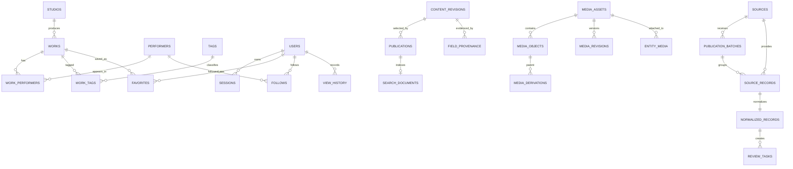

# Release A 数据模型与表清单

更新时间：2026-09-11（Asia/Shanghai）  
权威来源：`db/migrations/00001` 至 `00021`；当前 Schema 版本为 21。

迁移 21 新增 `platform.media_upload_control_state` 与 `audit.media_upload_commands`：管理员五分钟上传暂停/恢复请求、不可变身份与原因、单一执行租约及签名回执。当前总计 62 张表、5 个公开视图。API 仅提交；日本 Worker 记录派发再调用北京执行端，结果未知不能当作已应用，远端状态不可回退。迁移文件已开发，实际 PostgreSQL 执行仍待验收。

迁移 20 新增 `audit.media_usage_reviews`：管理员复核/账期切换请求及不可变前后快照；`platform.media_usage_state.last_review_id` 绑定实际变更回执。复核本身不恢复上传。

迁移 19 新增账户操作量持久状态与观察记录，保留账户摘要、明确账期、策略快照、累计高水位、复核/停用建议、调度租约及完成/失败证据。

迁移 18 新增独立每日图片检查审计表，保存检查 origin、对象/关联计数、状态问题、默认图探测结果与失败证据。

迁移 17 不增加表或视图数量；它收紧 `platform.public_entity_media`，要求图片所属作品/人物同时存在于相应的主站公开发布视图。草稿、隐藏、下架、合并、缺少主站 publication 的资料均不可通过公开图片视图查询；原有图片关联可以提前准备，无需在资料发布时重新登记。

本文是 Release A 的数据库导航和轻量 ERD。字段、约束、索引、权限与回滚逻辑以迁移文件为准；本文不能替代迁移，也不得从运行库手工反向修改后再覆盖迁移。

## 1. Schema 边界

| Schema | 数据所有权 | Release A 写入者 | 公开读取边界 |
| --- | --- | --- | --- |
| `collector` | 来源、批次、候选、审核任务与媒体候选 | 受控导入、运营 API；自动采集关闭 | 不公开 |
| `platform` | 正式资料、账号、发布、搜索、图片、用户功能与聚合指标 | Go API、仅限任务表的日本 Go Worker | 仅通过 `public_*` 视图和 Go API |
| `audit` | 登录、操作、下架、备份、归档、通知和媒体对账证据 | Go API/Worker、受控运维脚本 | 仅运营权限 |

运行账号使用 NOLOGIN 权限组和独立 LOGIN：`platform_api_login`、`platform_worker_login`。数据库 owner 只用于迁移、备份与恢复。

## 2. 核心关系图



多态字段（例如 `content_type + content_id`、`entity_type + entity_id`）由 CHECK、发布服务和合同测试共同约束，因此图中只展示主要实体关系，不伪造数据库中不存在的多态外键。

## 3. `collector` 表（10）

| 表 | 用途 |
| --- | --- |
| `collector.sources` | 来源域名/类型、优先级、状态、权利状态与核验时间 |
| `collector.source_connectors` | 区域连接器版本、游标和计划；Release A 保持禁用自动连接器 |
| `collector.publication_batches` | 人工/批次导入的幂等键、请求哈希、计数与结果 |
| `collector.source_records` | 来源外部 ID、原始 JSON、内容哈希与幂等记录 |
| `collector.raw_snapshot_refs` | 原始快照的路径、哈希、字节数和过期时间引用 |
| `collector.normalized_records` | 解析版本、规范化候选、校验错误和候选状态 |
| `collector.jobs` | Release B 预留的区域任务、租约、重试与死信状态 |
| `collector.review_tasks` | 新资料、字段、重复、冲突、媒体、权利和发布审核队列 |
| `collector.conflict_reviews` | 字段冲突、候选值、人工裁决与关闭状态 |
| `collector.media_staging` | 受控图片候选、来源、权利、下载与审核状态 |

## 4. `platform` 表（40）

### 4.1 资料与关系

| 表 | 用途 |
| --- | --- |
| `platform.system_metadata` | 当前数据库 Schema 版本与系统元数据 |
| `platform.studios` | 厂牌名称、规范 slug 和发布状态 |
| `platform.tags` | 标签字典与可见状态 |
| `platform.performers` | 人物公开艺名、可选资料、官方链接和发布状态 |
| `platform.works` | 番号、标题、发行日、厂牌、摘要和发布状态 |
| `platform.work_aliases` | 作品的番号、标题、翻译和历史 slug 别名 |
| `platform.performer_aliases` | 人物别名、语言和规范形式 |
| `platform.performer_source_mappings` | 来源人物 ID 到正式人物 UUID 的映射 |
| `platform.work_performers` | 作品与人物多对多关系及展示顺序 |
| `platform.work_tags` | 作品与标签多对多关系 |

### 4.2 账号与用户数据

| 表 | 用途 |
| --- | --- |
| `platform.users` | 用户邮箱、密码哈希、角色、验证和账号状态 |
| `platform.sessions` | 哈希 session、有效期、撤销时间和原因 |
| `platform.email_challenges` | 注册、重置和关闭账号验证码哈希及尝试次数 |
| `platform.security_rate_limits` | 邮箱/IP/用户维度的安全限流桶 |
| `platform.user_invitations` | owner/admin 邀请、角色、验证码哈希、有效期和消费状态 |
| `platform.favorites` | 用户收藏作品及软删除状态 |
| `platform.follows` | 用户关注人物及软删除状态 |
| `platform.view_history` | 登录用户精确浏览时间、前端删除和长期归档状态 |
| `platform.hidden_preferences` | 用户隐藏/恢复不感兴趣作品的状态 |
| `platform.feedback` | 登录用户纠错、来源建议、权利和其他反馈队列 |

### 4.3 版本、发布、搜索与指标

| 表 | 用途 |
| --- | --- |
| `platform.field_provenance` | revision 级字段来源、URL、标题、置信度和核验人 |
| `platform.content_revisions` | 人物/作品/厂牌 JSON 版本、审核状态与父版本 |
| `platform.publications` | 站点当前发布 revision、公开 slug、隐藏和下架状态 |
| `platform.redirects` | 合并或历史地址的 301/308 重定向 |
| `platform.search_documents` | 仅已发布资料的番号、标题、人物、别名和厂牌搜索文档 |
| `platform.search_metrics_hourly` | 不含查询词和用户标识的搜索请求/零结果小时聚合 |
| `platform.content_metrics_hourly` | 不含匿名标识的作品、人物、厂牌浏览小时聚合 |
| `platform.site_content_rules` | 首页作品/人物混排等运营规则 |
| `platform.editorial_recommendations` | 作品编辑推荐排期、状态和排序 |
| `platform.entity_merges` | 重复实体合并映射、操作者和原因 |
| `platform.outbox_events` | 发布、缓存、sitemap、归档和媒体删除副作用任务 |

### 4.4 图片与邮件运行状态

| 表 | 用途 |
| --- | --- |
| `platform.media_assets` | 逻辑图片资产、来源、权利、当前版本与发布状态 |
| `platform.media_objects` | S3/北京/日本对象的一一键、尺寸、哈希、字节与状态 |
| `platform.media_derivations` | 母版到 WebP 派生图的工具和参数关系 |
| `platform.media_revisions` | 图片版本 manifest、编辑人、工具版本和原因 |
| `platform.entity_media` | 图片资产与作品/人物的用途、顺序、主图和发布状态 |
| `platform.email_delivery_state` | 邮件熔断连续失败数和开启时间 |
| `platform.email_delivery_daily` | 每日邮件预留、成功与失败额度 |
| `platform.media_usage_state` | 单账户观察调度、明确账期/策略身份、高水位与不可自动清除的复核/停用建议；日本 Worker 写、API 只读、公开角色无权限 |
| `platform.media_upload_control_state` | 北京控制目标摘要、最近可信回执、观察时间/错误、单一执行租约；日本 Worker 写、API 只读，不保存控制密钥 |

`platform.entity_media` 的 Release A 应用合同为：作品 `cover` 主图使用位置 0，作品 `gallery` 使用互不重复的位置 1-3，人物 `avatar` 主图使用位置 0。精选图要求已有 published 主图且最多三张；父资料行锁串行化 API 登记。公开查询会再次过滤不符合该组合的历史行，并在缺少有效主图时返回空图片，由公开站使用默认图。当前 Schema 仍为 v21，真实 PostgreSQL 槽位并发合同尚待执行。

## 5. `audit` 表（12）

| 表 | 用途 |
| --- | --- |
| `audit.audit_logs` | 按 request ID 关联的追加式运营和系统审计 |
| `audit.login_events` | 登录成功、失败、锁定和限流结果，不保存明文凭据 |
| `audit.account_closure_events` | 关闭账号验证码、说明版本和请求证据 |
| `audit.takedown_requests` | 权利下架申请、处理状态与完成证据 |
| `audit.archived_history_manifests` | 浏览历史 gzip JSONL 的范围、哈希和文件证据 |
| `audit.backup_runs` | 备份、北京复制、空库恢复和 verified 状态机 |
| `audit.notification_deliveries` | 通知类型、结果和发送证据 |
| `audit.media_reconciliation_runs` | S3 与北京副本缺失、损坏和孤儿对象对账结果 |
| `audit.media_inspection_runs` | 每日注册图片公开状态与两张默认图检查；UUID 有界样本、探测 origin、HTTP 状态及错误码，不保存响应正文 |
| `audit.media_usage_runs` | 账户操作量的查询窗口、租约运行、有限结构化观察/判定或失败代码；完成后不可覆盖，不保存 token/原始响应 |
| `audit.media_usage_reviews` | 管理员人工复核/账期切换请求、幂等身份、五分钟期限、异步结果及实际变更前后快照；API 仅提交，Worker 仅结算 |
| `audit.media_upload_commands` | 上传暂停/恢复的操作者、幂等键、目标/快照、期限、首次派发/次数、最终回执；同时只允许一项待处理，完成证据不可覆盖 |

## 6. 公开视图（5）

| 视图 | 可见性合同 |
| --- | --- |
| `platform.public_published_works` | 只返回当前 published 的作品 revision |
| `platform.public_published_performers` | 只返回已发布且满足成人状态约束的人物资料 |
| `platform.public_published_studios` | 只返回已发布厂牌资料 |
| `platform.public_search_documents` | 只返回仍处于 published 状态的搜索文档 |
| `platform.public_entity_media` | 只返回权利允许、资产/关系/对象均 published 的公开图片 |

## 7. Release A 核心不变量

- 自动采集关闭：`COLLECTION_ENABLED=true` 时 Go Worker 启动失败；`collector.jobs` 和连接器只是后续边界。
- 只有 approved revision 能成为 publication；发布视图是公开 API 的唯一资料事实来源。
- revision 发布前必须具备对应来源证据；运营录入不能绕过 provenance。
- 匿名访问只增加 `content_metrics_hourly`；有效登录才追加 `view_history`，且前端删除只设置软删除状态。
- 图片必须通过 `media_assets → media_objects/derivations/revisions → entity_media` 映射，禁止运营页面手填对象 URL 代替 manifest。
- `search_metrics_hourly` 不保存查询词、IP、Cookie 或匿名 ID；当前可计算搜索量和零结果率，不能宣称已计算结果点击率。
- 审计证据、备份验证、历史归档和媒体对账分别进入 `audit`，不能用普通业务日志替代。
- 跨系统副作用先与业务事务一起写入 `outbox_events`，由日本 Worker 租约处理；失败重试，超过阈值进入 dead。

## 8. 变更与验证

新增表、删除表、改名或新增公开视图时必须：

1. 新建可回滚迁移并递增 `platform.system_metadata.schema_version`；
2. 更新本文件的表数、清单、关系和不变量；
3. 更新 Go `/readyz` 所需 Schema 版本及 Compose/CI 迁移流程；
4. 运行数据库迁移合同、fresh/rollback 和受限运行账号权限合同；
5. 如影响公开数据，补 OpenAPI、缓存失效、搜索和下架回归。

本地静态一致性检查：

```powershell
python -m unittest discover -s db/tests -p "test_*.py"
```

真实 PostgreSQL 验证按 [Release A 本地联调手册](./RELEASE_A_RUNBOOK.md) 执行。
