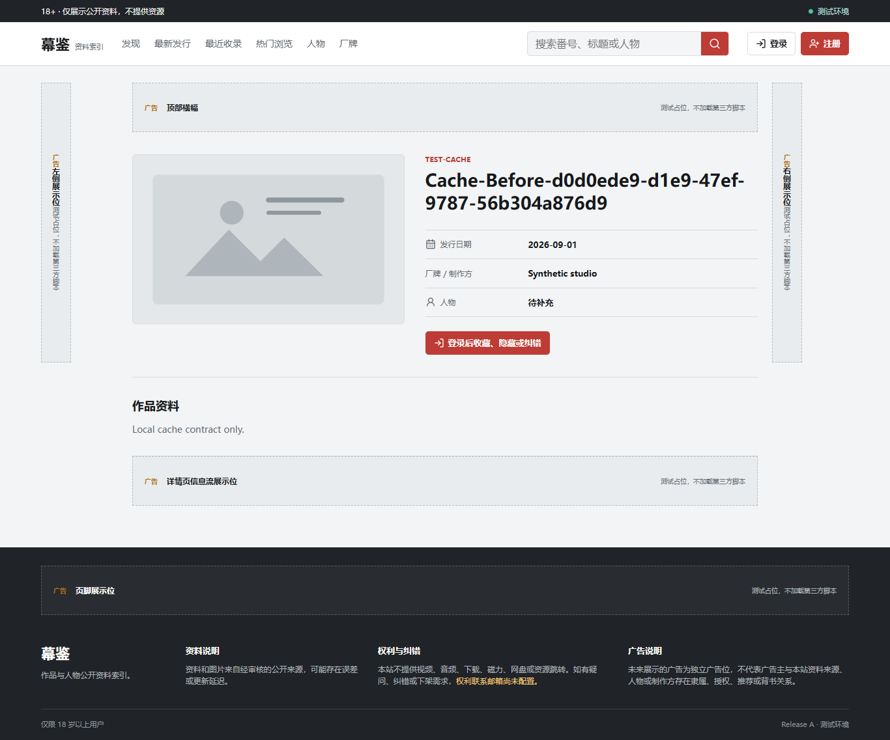
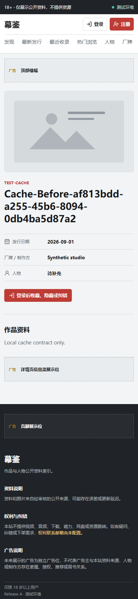

# Release A 主动默认图执行端验证

日期：2026-09-11。配置 `MEDIA_DELIVERY_MODE=normal|default_only`；无数据库迁移/业务对象状态修改，Schema 保持 v18。

## 结果

- Go API 对公开/用户目录 DTO 做只读投影：覆盖首页、搜索、列表、三类详情和用户收藏/关注/关注作品/隐藏/历史。图片及派生地址不输出，文字/ID/链接/精确时间保留；运营证据不去除，后续恢复 normal 验证源对象未被改写。
- Python CLI 在创建 SDK 前拒绝新 `prepare`；适配器也拒绝新上传准入。本地检查、状态/恢复和 S3 删除验证不受此模式阻断。两地/根级模板、生产配置验证已接入。
- Next 新渲染做无副作用去图，覆盖 metadata、JSON-LD、RSC 及页面图；请求级完整 CSP 对旧缓存 HTML 拒绝跨源图片。补水合前已失败图片的默认图切换，不只依赖晚绑定 onError。
- Nginx 保留停图 no-store，不覆盖成目录公共 TTL；新私有 gauge 表示配置模式，明确不代表账户使用量。CSP 正常与停图模式仅图片来源规则不同，其他安全头、Turnstile 与表单/框架限制保留。

## 已执行的验证

| 验证 | 结果/边界 |
| --- | --- |
| Go API/Worker vet/test | 全包通过，显式 MEDIA_CONTRACT_PYTHON 启用本机实际 Go→Python 删除/对账 HTTP；真实 SQL 合同未配置，不计为通过 |
| API 目录专项 | 15 路径 × normal/default_only/invalid/恢复 normal；标题保留、媒体消失、no-store/header、不可变原数据及私有 metric/账号/readiness 通过 |
| Python 全回归 | **216 passed + 123 subtests，1 skipped，91.20 秒**；skipped 为本机无法创建符号链接，非真实存储验证 |
| Python ruff/mypy | 全范围 ruff 通过，15 个生产源文件 mypy 通过 |
| 两站 TypeScript/ESLint | 通过 |
| 公开站 production build | 通过；后台本轮未修改，使用已有构建 |
| 前端/工具单元 | **15 / 56** 通过；新增不可变投影和完整 CSP 对比测试已接 CI/预检的原入口 |
| OpenAPI TypeScript | 无漂移；无新增业务 API/schema |
| 完整浏览器 | **46/46 通过，3.6 分钟**，含新增桌面/手机停图与恢复场景 |
| 两站 standalone HTTP | 通过；账号入口、默认图、CSS、JSON-LD、安全头、广告关闭及 API 503/no-store |
| API 二进制 | 编译通过，仅写入本地缓存，未启动 |
| 本地正常模式性能 | 首页/详情 × 桌面/手机、预热后各 3 样本的 LCP/CLS 均通过；无网络限速、合成 API，不是日本服务器或真实用户性能。原始数据见[性能证据](./release-a-media-delivery-performance-2026-09-11.json) |

浏览器专项先在正常模式通过本地拦截器提供合成 1px 图，确认确有远程图片请求；随后停止该 Next 测试进程，在**同一份隔离 ISR/Data Cache** 上用 default_only 重启。断言旧首页 HTML 仍含原远程标识，但响应携带限制 CSP/no-store，新浏览器上下文没有一次进入远程图片拦截器，实际默认图 naturalWidth 大于 0。之后通过真实 Next HMAC 失效端点刷新，详情 HTML（含 OG/JSON-LD/RSC）不再出现远程图片标识；恢复 normal 并刷新后再次加载合成图片。两种视口完整通过，不用“无图 fixture”冒充停图验证。

专项初轮截图中匿名操作显示不可用，是精简目录替身对 `/me` 返回 404；补为与实际匿名协议一致的 401 后，新增“登录后收藏、隐藏或纠错”可见断言，并在最终完整 46 项套件重跑。没有修改产品以隐藏此夹具错误。

静态合同初轮发现新增公开站环境变量不在白名单、CSP 抽到共享模块后旧检查仍只读 next.config；已更新合同明确验证新变量和导入/完整策略，保留限制，不删除安全断言。Nginx 的 no-store 修改有静态映射/继承合同，未运行真实 Nginx。

## 复现入口

```powershell
npm run typecheck
npm run lint
npm run build --workspace @self-deepsearch/display-web
npm run test:frontend:smoke
npm run test:e2e:release-a
npm run smoke:frontend:release-a
$env:PYTEST_DISABLE_PLUGIN_AUTOLOAD='1'
./.venv/Scripts/python.exe -m pytest -q -p no:cacheprovider
```

## 未执行与不作出的保证

没有启动 Docker、真实 PostgreSQL/SMTP/S3/R2/Cloudflare、远程 CI；没有暂存、提交、推送或构建真实镜像。浏览器运行器使用安全检查过的 `.cache` 隔离副本，测试完成后清理；没有把未知页面连接或用户真实浏览器状态当测试数据。

该执行端没有 A/B 月额度、账户 GB-month 自动计量/触发；不全局阻断已知对象 URL、旧已打开标签页、边缘已有缓存或非浏览器客户端。全目标仍需账户计量与延迟/失败策略、预算预留、非必要任务限流、图片源站入口控制、真实环境业务/资源验收。不能宣称账户零费用或 M5/Release A 完成，公网仍 no-go。

配套重启、Next/Cloudflare HTML 失效、源站控制与恢复顺序见[运行手册](../MEDIA_DELIVERY_MODE.md)。

## 视觉证据

正常资料布局保留：桌面双栏、手机单栏，默认图完整显示。图片、编号、标题和日期均为合成测试数据；不是实际作品或运行账户。

最终截图 SHA-256：桌面 `9cd8ed5292203943bd5d97141ca3095478cbbce4c6724dcab03b47e847a3bf67`，手机 `6ee2a1c8d8db205e22d8c5c76a1fe35a0553327cbf0cf26f1c1397b962002ca9`。两张已重新视觉复核，默认图和匿名登录操作均正常，无红色不可用提示。




