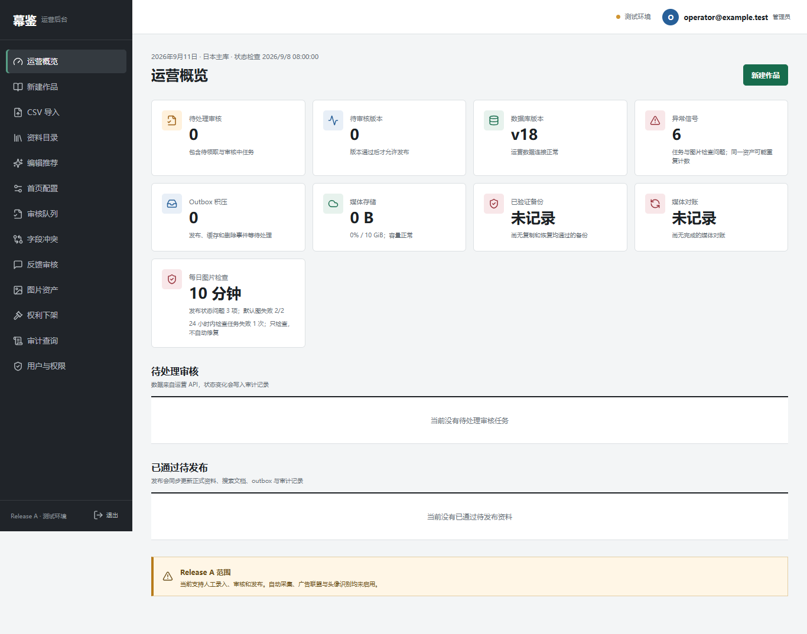
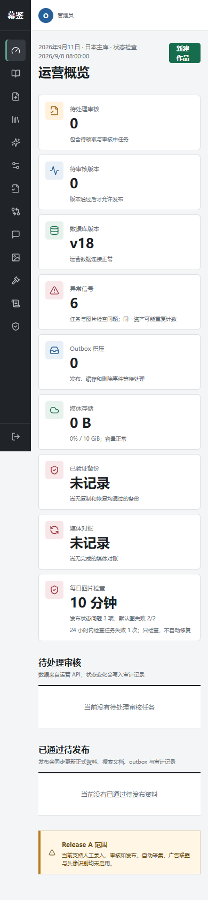

# Release A 每日图片检查验证

日期：2026-09-11（Asia/Shanghai）。范围：继续既有 Release A，补每日注册公开状态与默认图实际可读性检查。未启用自动采集、联盟广告或头像识别。

## 实现结果

- 日本 Go Worker 独立任务，固定 24 小时周期；advisory lock 后用新快照决定运行，读业务数据使用独立只读一致性事务。5 分钟检查到期状态/中断，网络前释放连接，整体 45 秒上限。每类库存超过 10000 明确失败，不部分完成。
- 检查对象 scope/key/URL、版本/权利/发布状态、公开关联三档派生与隐藏公开对象的有效删除队列。允许草稿/隐藏父资料提前准备、共享资产与私有母版保留；不自动删改业务数据。
- 两张固定 SVG 实际 HTTP GET：200、SVG MIME、完整内容和发布文件哈希，LF/CRLF 兼容；每张 5 秒/64 KiB，不带会话、不跟随跳转、不访问记录 URL。改默认图须同步 Worker 哈希与公开站制品。
- 迁移 18 新增 `audit.media_inspection_runs`，记录 origin、计数、有界 UUID 样本、两张探测结果与失败原因。不存远端响应正文或用户行为。当前 18 个迁移、57 张表、5 个公开视图，PostgreSQL 引擎仍为 16。
- 系统健康 API/OpenAPI 新增 `media_inspection_age_seconds`、`media_publication_issues`、`default_image_failures`、`failed_media_inspections`；仍是 83 个操作、72 个路径、95 个组件 Schema。无完成记录不伪造 age=0，系统状态 degraded；私有指标和从未完成/过旧/发现异常/任务失败告警对应接入。
- API readiness、seed、备份测试夹具、Schema 告警、CI 和可选 SQL 合同门槛同步 v18。日本部署要求检查开启；core 允许内部 origin，full 必须与 SITE_URL 一致。

## 已实际执行

| 验证 | 最终结果 |
| --- | --- |
| Go API/Worker `go vet`、全包 `go test -count=1` | 通过；显式指定仓库 Python，含既有实际 Go→Python HTTP 合同 |
| API、Worker 编译 | 通过；两份 `.cache/core-e2e` 二进制仅编译，未启动 |
| 每日检查单元/本机 HTTP | 正常生命周期、16 类对象异常、缺图/类型错配、样本完整计数、有界任务/失败语义；两张实际发布文件哈希核验通过 |
| HTTP 故障/恢复 | 正常、CRLF、404、重定向、错误 MIME、伪装 SVG 的登录页、空响应、超大/截断、读取失败与取消通过；重定向目标接收次数为 0 |
| API 健康与 metrics | 未检查、正常、过旧、对象异常、默认图失败、中断共 6 类；admin 限制/私有 metrics 和 unknown age 均通过 |
| 两站 TypeScript / ESLint、OpenAPI 漂移 | 通过 |
| 运营站 production build | 通过；公开站使用此前构建（本轮未改公开站页面） |
| Playwright 桌面/手机 | **44/44 通过，2.9 分钟**；新增未检查/异常/不可用/恢复同一场景 × 两个视口 |
| 前端单元烟测 / 工具合同 | **13 / 56** 通过 |
| 两站 standalone HTTP 冒烟 | 通过；默认图、CSS、安全头、账号入口、JSON-LD、广告关闭边界 |
| 完整串行 Python | **188 passed + 93 subtests，91.25 秒** |
| 迁移/配置/安全专项与 ruff | 专项 **94 passed + 70 subtests**，相关修改的 Python 文件 ruff 通过 |

新增 metrics 测试首次失败是测试夹具未提供数据库 ready 信号，已补正确夹具后重跑全套通过；没有把这次夹具失败报告成线上产品缺陷。

## 未执行与放行边界

`TestPostgresInspectionScheduleContract` 与 `TestPostgresInspectionSnapshotContract` 在本机明确 **SKIP：专用 PostgreSQL 未配置**。前者设计为实际受限 LOGIN、观察两条锁等待后只产生一个运行、完成不可覆盖；后者设计为事务内切换受限 Worker 角色，覆盖 11 类状态且合成数据回滚。CI 已按 outbox → 文件对账调度 → 每日检查串行接线，但未触发远程 CI。

未启动 Docker、真实 PostgreSQL、SMTP、S3/R2、Cloudflare，未执行迁移或 IAM/物理存储验证，未创建提交/暂存/推送。所有测试使用本机临时 HTTP 与合成目录，相关临时服务已退出。未重新执行容器实际运行、目标 Prometheus/Alertmanager 规则加载、真实邮件/存储生命周期或日本 2C4G 资源验收。

每日注册状态检查不证明 bucket 权限；固定默认图检查不等于逐张公开图片可读；文件对账仍独立覆盖物理孤儿/缺失/哈希。真实 SQL、权限、存储、缓存、部署与账号流程验收仍需完成，**M5 和 Release A 未整体验收，公网 no-go**。

规则、升级顺序及故障处理见[运行手册](../MEDIA_INSPECTION.md)。迁移 18 需配套 API/Worker/运营站，不能仅升级数据库后让 v17 API 保持运行；线上优先 roll-forward。

## 视觉证据

已逐张复核：1366px 桌面四列指标卡，390px 手机单列；新增检查卡片内容不溢出、异常为红色、总异常注明可能重复计数。图中邮箱、计数与时间均为测试夹具，不是真实生产状态。

